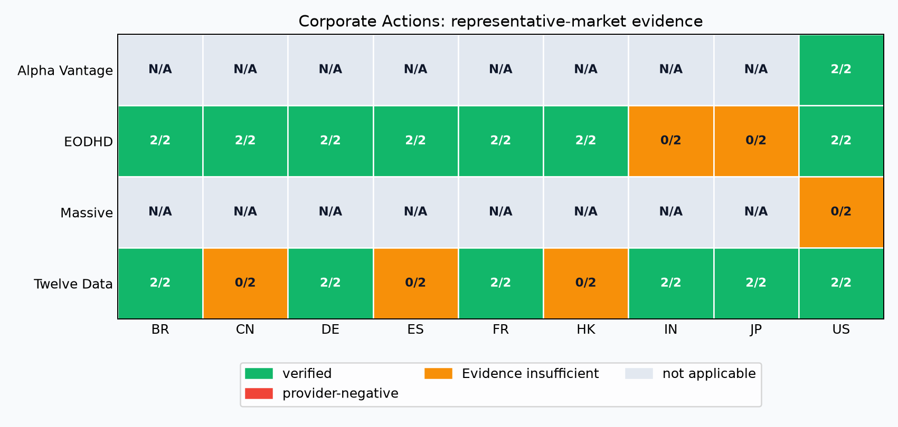
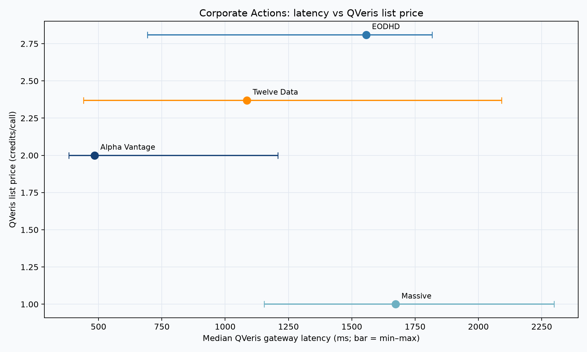

# Best Corporate Actions APIs for Developers

> Compare four QVeris corporate-actions paths using 72 live split-event calls across nine markets, with latency, public credits, pricing, and evidence limits.

Historical split-event retrieval across US, HK, CN, JP, DE, FR, BR, IN, and ES representative symbols, plus an explicit invalid-symbol control through the tested QVeris Access Paths. This edition covers 4 Providers × 4 Access Paths, nine representative markets, and 72 release-backed live calls. Every metric below is scoped to the tested Access Path, not the provider's entire native API surface.

## Quick recommendations

- **Lowest observed QVeris list price:** Massive · QVeris connector at 1 credits/call in this frozen inspect snapshot.
- **Lowest observed gateway latency:** Alpha Vantage · QVeris connector at a 485 ms median across 3 samples.
- **Broadest representative-market evidence:** EODHD · QVeris connector verified 7 of 9 tested markets.

These are separate trade-offs, not an overall winner.

## Comparison table

| Provider × Access Path | Fixed-sample outcome | Verified representative markets | Median gateway latency | QVeris list credits/call | Official provider pricing |
|---|---|---|---:|---:|---|
| Alpha Vantage · QVeris connector · [Official site](https://www.alphavantage.co/) · [Try it in QVeris](https://qveris.ai/providers/alphavantage) | Positive 3/3; invalid control 0/3 | US | 485 ms (n=3) | 2 | 25 API requests per day; Premium from USD 49.99/month ([official pricing](https://www.alphavantage.co/premium/); verified 2026-08-10) |
| EODHD · QVeris connector · [Official site](https://eodhd.com/) · [Try it in QVeris](https://qveris.ai/providers/eodhd) | Positive 3/3; invalid control 3/3 | BR, CN, DE, ES, FR, HK, US | 1557 ms (n=3) | 2.81 | 20 API calls per day; All-in-One USD 99.99/month ([official pricing](https://eodhd.com/pricing); verified 2026-08-10) |
| Massive · QVeris connector · [Official site](https://massive.io/) · [Try it in QVeris](https://qveris.ai/providers/massive_stocks) | Positive 3/3; invalid control 0/3 | Evidence insufficient | 1674 ms (n=3) | 1 | Evidence insufficient |
| Twelve Data · QVeris connector · [Official site](https://twelvedata.com/) · [Try it in QVeris](https://qveris.ai/providers/twelvedata) | Positive 3/3; invalid control 0/3 | BR, DE, FR, IN, JP, US | 1086 ms (n=3) | 2.37 | Basic with 8 API credits per minute and 800 per day; Grow from USD 29/month ([official pricing](https://twelvedata.com/pricing); verified 2026-08-10) |

“Verified” means every frozen round met the CAP contract. “Provider-negative” means every round returned an explicit provider-level negative outcome; it does not prove permanent lack of support. “Not applicable” means the frozen plan explicitly excluded that market. “Evidence insufficient” means the Release did not establish a provider conclusion for that market.

## Market coverage

| Provider × Access Path | BR | CN | DE | ES | FR | HK | IN | JP | US |
|---|---|---|---|---|---|---|---|---|---|
| Alpha Vantage · QVeris connector | N/A | N/A | N/A | N/A | N/A | N/A | N/A | N/A | 2/2 verified |
| EODHD · QVeris connector | 2/2 verified | 2/2 verified | 2/2 verified | 2/2 verified | 2/2 verified | 2/2 verified | 0/2 Evidence insufficient | 0/2 Evidence insufficient | 2/2 verified |
| Massive · QVeris connector | N/A | N/A | N/A | N/A | N/A | N/A | N/A | N/A | 0/2 Evidence insufficient |
| Twelve Data · QVeris connector | 2/2 verified | 0/2 Evidence insufficient | 2/2 verified | 0/2 Evidence insufficient | 2/2 verified | 0/2 Evidence insufficient | 2/2 verified | 2/2 verified | 2/2 verified |

The matrix is one representative symbol per market from the market Release; it is not a claim of full market coverage.

## Latency and QVeris list-price trade-off

Latency is measured only through the QVeris gateway Access Path. Credits are QVeris inspect list prices, not an individual account's billed consumption or a provider's direct API plan.

## Agent integration notes

| Provider × Access Path | Invalid-input handling | Integration note |
|---|---:|---|
| Alpha Vantage · QVeris connector | 0/3 | No explicit rejection observed; handle failures defensively. |
| EODHD · QVeris connector | 3/3 | Explicit rejection is release-backed. |
| Massive · QVeris connector | 0/3 | No explicit rejection observed; handle failures defensively. |
| Twelve Data · QVeris connector | 0/3 | No explicit rejection observed; handle failures defensively. |

Do not treat this as an AI-friendly score. Validate the returned instrument identity, event date semantics, currency, pagination, and any market-specific symbol dialect in your own integration.

## How we tested, reproduce, and contribute

The baseline Release digest is `sha256:3104ce0ca902bf2aeff7954fc175bd6632adc5b5e56a56011d7a0adf6f89a0ae`. The market Release digest is `sha256:ad621c183b893b54f8aec930ac225066aa9f288c161fdf6a0587e115f1b23463`. Reproduce the package offline with `qveris-bench publication reproduce --package docs/guides/capability-seo/best-corporate-actions-apis/manifest.yaml --expected-package-digest "$(python -c "import json; print(json.load(open('docs/guides/publication-attestations/best-corporate-actions-apis-2026-08-14-v2.json'))['package_digest'])")"`. To create a new edition, run the CAP with your own `QVERIS_API_KEY`; a rerun must use a new Release ID and never overwrite this evidence.

Suppliers may submit a binding, reproducible case, or factual correction through the repository. Inclusion and conclusions cannot be purchased.

## Limitations and FAQ

**Does this rank every provider?** No. It compares only the frozen Provider × Access Path cohort for this CAP edition.

**Does a verified market mean all symbols work?** No. It means the representative frozen market case satisfied the contract in every observed round.

**Why can a provider have different results elsewhere?** Native APIs, other connector tools, plan tiers, symbols, and observation dates are different access paths or test conditions.
