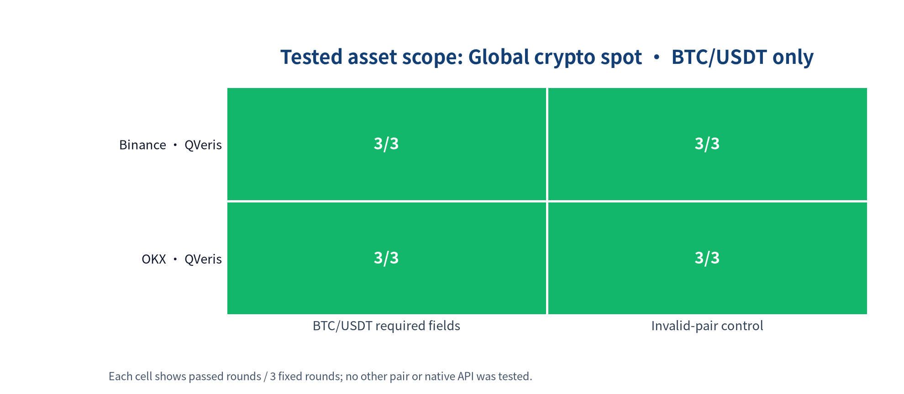
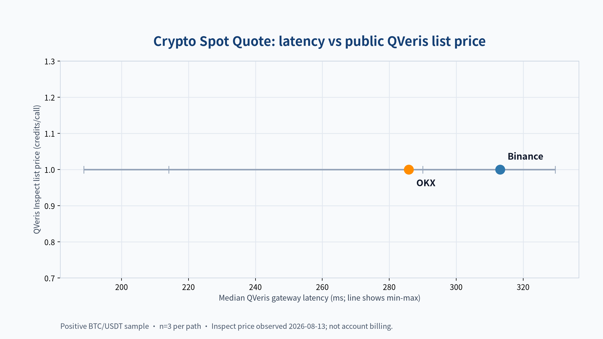

# Best Crypto Spot Quote APIs 2026: Binance vs OKX

For a BTC/USDT spot-price workflow, both tested paths returned the required price and 24-hour OHLC fields in all three fixed samples, and both rejected the invalid-pair control in all three samples. OKX was the lower-latency path in this small test. This is a comparison of the tested QVeris Access Paths, not a native API benchmark or a general ranking of either exchange.

## Results at a glance

The table answers one narrow developer decision: can this path return a current, exchange-specific BTC/USDT spot quote with `price`, `open`, `high`, and `low`, while refusing a made-up pair?

| Tested path | BTC/USDT required fields | Invalid-pair control | Median gateway latency, positive sample | QVeris list price | Links |
| --- | --- | --- | --- | --- | --- |
| Binance / QVeris Access Path | Sample passed, 3/3 | Rejected, 3/3 | 313 ms | 1 credit/call | [Binance](https://www.binance.com/) · [Try it in QVeris](https://qveris.ai/providers/binance) |
| OKX / QVeris Access Path | Sample passed, 3/3 | Rejected, 3/3 | 286 ms | 1 credit/call | [OKX](https://www.okx.com/) · [Try it in QVeris](https://qveris.ai/providers/okx_api_v5) |

“3/3” means three repetitions of this exact sample, not universal exchange or pair coverage. “Rejected, 3/3” means the invalid input did not yield quote facts; it does not prove every invalid-input behavior is identical. The cost column uses the public QVeris tool list price, not account-specific billed credits.

## How developers should choose

Choose the exchange whose venue-specific quote your application needs. In this frozen sample both paths met the same minimum contract and had the same public QVeris list price; OKX had the lower observed median gateway latency. That is a narrow latency observation, not an overall winner.

Do not choose from this page if you need a cross-exchange consolidated price, historical candles, perpetuals, options, or on-chain data. Those are different developer decisions and require separate evidence.

For an Agent, freeze the selected tool in your own integration. Validate returned identity, require finite positive OHLC values, and treat the released provider-negative outcome as an application-level rejection rather than inferring behavior from transport status. Parameter clarity and a constrained Agent Trial remain unmeasured in this edition.

## Tested asset scope



The matrix shows the complete scope of this edition: one global crypto-spot sample, BTC/USDT, on two QVeris Access Paths. A green positive cell means all three fixed rounds returned the required identity and quote fields. A green invalid-control cell means all three rounds produced a provider-level rejection without quote facts. It does not establish support for another pair, venue, instrument type, or native exchange interface.

## Latency and pricing trade-off



Both paths had the same public QVeris Inspect price on 2026-08-13: 1 credit/call. The horizontal position is median QVeris gateway latency for the three positive rounds; the line spans the observed minimum and maximum. These are three-sample gateway observations, not native exchange latency or a service-level guarantee.

Official source context is separate from QVeris pricing:

| Provider × Access Path | Official pricing fact | Verified | Source |
| --- | --- | --- | --- |
| Binance / QVeris Access Path | Public market-data documentation does not state a subscription charge for this endpoint. No provider-paid plan claim is used for the managed QVeris Access Path. | 2026-08-13 | [Binance Spot API market data](https://developers.binance.com/docs/binance-spot-api-docs/rest-api/market-data-endpoints) |
| OKX / QVeris Access Path | Public market-data documentation does not state a subscription charge for this endpoint. No provider-paid plan claim is used for the managed QVeris Access Path. | 2026-08-13 | [OKX market ticker API](https://www.okx.com/docs-v5/en/#rest-api-market-data-get-ticker) |

## Agent integration notes

| Provider × Access Path | Positive case | Invalid input | Required fields | Unmeasured signals |
| --- | --- | --- | --- | --- | --- |
| Binance / QVeris Access Path | Sample passed, 3/3 | Provider rejected, 3/3 | `price`, `open`, `high`, `low`, 3/3 | Parameter clarity, pagination, and constrained Agent Trial |
| OKX / QVeris Access Path | Sample passed, 3/3 | Provider rejected, 3/3 | `price`, `open`, `high`, `low`, 3/3 | Parameter clarity, pagination, and constrained Agent Trial |

These are separate interface signals, not an Agent-friendly score. The public terminal evidence establishes that the invalid pair produced a provider-negative outcome with no quote facts; it does not publish a transport-status claim.

## Method, reproduction, and contribution

This edition ran 12 live calls on 2026-08-13: two Provider × Access Path identities, one positive case and one invalid-pair case, each repeated three times.

The positive case requested a BTC/USDT spot quote. A sample passed only when the response identified the expected exchange, `USDT` quote currency, and normalized `BTCUSDT` symbol, and supplied finite, positive `price`, `open`, `high`, and `low` values. The negative case used an intentionally non-existent pair. A sample passed that control only if no quote facts were published.

Latency is QVeris gateway elapsed time for the positive case. It is not native exchange latency, a p95 latency claim, or a promise for another region, account, or routing condition. Both sources report exchange-defined rolling 24-hour values; they are not interchangeable with a shared market bar.

You can verify the published release from the [benchmark repository](https://github.com/QVerisAI/qveris-capability-benchmarks) without credentials or provider calls:

```bash
git clone https://github.com/QVerisAI/qveris-capability-benchmarks.git
cd qveris-capability-benchmarks
uv sync --locked --all-groups
uv run qveris-bench publication reproduce \
  --package docs/guides/capability-seo/best-crypto-spot-quote-apis/manifest.yaml \
  --expected-package-digest <published-package-digest>

uv run qveris-bench release replay releases/crypto-spot-quote-2026-q3-v1 \
  --expected-digest sha256:82f79c8f44283bfd395d8d0bf92b7b3b100f9af966987d917b200cd8638a111f
```

To make a new live edition, provide `QVERIS_API_KEY` or authenticate locally with the QVeris CLI, then run `uv run python scripts/run_crypto_spot_quote.py --release-id crypto-spot-quote-2026-q4-v1`. The ID must be new: the runner refuses to overwrite a published edition. Raw responses remain outside the repository; the release contains only sanitized terminal facts and their digests.

Providers and contributors can submit a reproducible correction or an additional Access Path through the [contribution guide](https://github.com/QVerisAI/qveris-capability-benchmarks/blob/master/CONTRIBUTING.md). Inclusion cannot be purchased, and an added path is tested separately rather than merged with an existing provider row.

For adjacent implementation guidance, see [Crypto market data API for AI agents](https://qveris.ai/guides/crypto-market-data-api-for-ai-agents/) and [Cryptocurrency price API for AI agents](https://qveris.ai/guides/cryptocurrency-price-api-for-ai-agents/).

## Limitations, disclosures, and corrections

This is a two-path, BTC/USDT-only sample. It does not establish wider pair coverage, reliability over time, native API behavior, or an overall “best crypto API.” Both rows use QVeris-managed connector access; no personal provider credential or account-specific discount is disclosed. Official exchange documentation is available from [Binance](https://developers.binance.com/docs/binance-spot-api-docs/rest-api/market-data-endpoints) and [OKX](https://www.okx.com/docs-v5/en/#rest-api-market-data-get-ticker).

If a factual claim is wrong, open a reproducible issue with the exact request, expected result, observation time, and a public source when possible. A correction produces a new edition; it never rewrites this release.

## FAQ

### Which crypto spot quote API won?

Neither. In this fixed BTC/USDT test, both tested QVeris paths passed the required-field and invalid-pair checks. OKX had the lower median gateway latency in this snapshot.

### Does 3/3 mean Binance or OKX supports all crypto pairs?

No. It means the single fixed BTC/USDT sample completed three times. Test your own exchange, pair, and quote-currency requirements before production use.

### Can I use this with an AI Agent?

Yes, if you keep the selected tool and its parameter dialect fixed, validate response identity and values, and handle provider-level error payloads. This release does not publish an aggregate Agent-friendly score.
