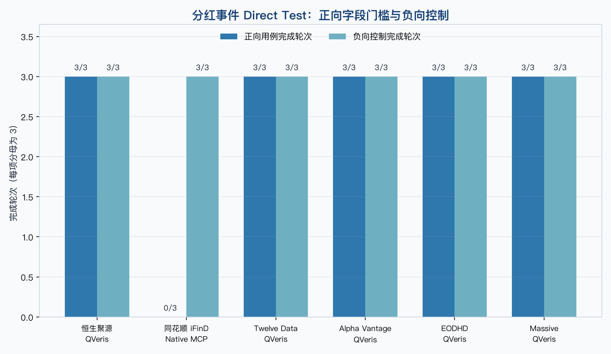

# 2026 分红数据 API 对比：6 条 Access Path 的可复测结果

如果你的程序必须同时拿到**除权除息日**和**每股现金分红金额**，本次实测中，恒生聚源、Twelve Data、Alpha Vantage、EODHD、Massive 的 QVeris Access Path 达到这项单一能力的发布门槛；同花顺 iFinD 的 Native MCP 在正向用例中返回了每股分红金额，但没有返回可核验的除权除息日，因此本版为 **Not qualified**。

这是 2026-08-11 的可复现快照，不是供应商综合排名。结论绑定 immutable release `dividend-events-2026-q3-v1`：6 条 Access Path、2 类适用用例、每项 3 轮，共 **36 次适用 Direct Test**。另有 18 个明确的 N/A 矩阵单元，不拿不适用市场给供应商加分或扣分。

## 先看结果

| 供应商与 Access Path | 正向字段门槛 | 无效代码负向控制 | 本 CAP 结论 | 你需要的凭证 |
|---|---:|---:|---|---|
| 恒生聚源（QVeris） | 3/3 | 3/3 | **Qualified** | QVeris key |
| 同花顺 iFinD（Native MCP） | 0/3 | 3/3 | **Not qualified**：缺可核验除权除息日 | iFinD Native MCP key |
| Twelve Data（QVeris） | 3/3 | 3/3 | **Qualified** | QVeris key |
| Alpha Vantage（QVeris） | 3/3 | 3/3 | **Qualified** | QVeris key |
| EODHD（QVeris） | 3/3 | 3/3 | **Qualified** | QVeris key |
| Massive（QVeris） | 3/3 | 3/3 | **Qualified** | QVeris key |

这里的 Qualified 只表示：在冻结输入与公开规则下，该 Access Path 连续 3 轮满足本次分红事件字段门槛，并正确处理负向控制。它不代表价格、覆盖范围、延迟或其他能力更好。



## 我们具体测了什么

正向用例要求响应中存在可核验的 `effective_date`（除权除息日）和 `amount`（每股现金分红金额），且数值和日期格式满足 CAP Pack 的规则。美股路径使用 `AAPL` 固定时间窗；A 股路径使用 `600519.SH` 固定时间窗。

负向控制使用明确无效的 symbol，要求接口返回空态或可归因的供应商拒绝，不能编造分红记录。每条适用 Access Path 的正向与负向用例各执行 3 轮。Direct Test 是强制项；没有真实调用证据，就不会发布 Qualified 结论。

本版共有 54 个预先规划的矩阵单元：36 个适用单元全部产生终态证据，其中 33 个 `completed`，3 个 iFind 正向单元为 `provider_negative`；其余 18 个因市场不适用而保持 N/A。原始响应默认私有，仓库只提交通过脱敏与授权检查的公开证据。

## 怎么选：先选接入方式，再看本 CAP 事实

如果你想用一个 key 复测多家供应商，五条 QVeris Access Path 共用 QVeris key。它减少认证和调用方式的差异，但本文测得的延迟与 credits 是 QVeris 网关侧观测，不能冒充供应商 Native API 的性能或官网定价。

如果你已经有 iFind 权限，可以直接用 iFind Native MCP key 复测。iFind 在本次三轮正向调用中确实返回了每股分红金额；我们将它判为 Not qualified 的唯一直接原因，是响应没有提供可核验的除权除息日。我们没有从年度累计分红、市场或发行人身份推断这个字段，也没有推断币种。

## 六条 Access Path 的可核验信息

### 恒生聚源（QVeris）

本次用 `600519.SH` 测试 A 股分红事件，正向字段门槛和负向控制均为 3/3。供应商资料见[聚源基础数据库](https://www.gildata.com/products/core-data.html)。[Try it in QVeris](https://qveris.ai/providers/hangseng_polysource)。

### 同花顺 iFinD（Native MCP）

本次只测官方 Native MCP，不把它写成 QVeris 接入。正向三轮均返回每股分红金额，但三轮都缺少可核验的除权除息日；负向控制为 3/3。安装与认证方式以[iFinD 官方 MCP 指南](https://mcp.51ifind.com/gwstatic/static/ds_web/ifind-mcp-web/skills/SKILL_INSTALL_GUIDE.md)为准。

### Twelve Data（QVeris）

本次用 `AAPL` 测试，正向字段门槛和负向控制均为 3/3。供应商字段说明见[Twelve Data Dividends 文档](https://twelvedata.com/docs#dividends)。[Try it in QVeris](https://qveris.ai/providers/twelvedata)。

### Alpha Vantage（QVeris）

本次用 `AAPL` 测试，正向字段门槛和负向控制均为 3/3。供应商字段说明见[Alpha Vantage Dividends 文档](https://www.alphavantage.co/documentation/#dividends)。[Try it in QVeris](https://qveris.ai/providers/alphavantage)。

### EODHD（QVeris）

本次用 `AAPL` 测试，正向字段门槛和负向控制均为 3/3。供应商字段说明见[EODHD Splits and Dividends API](https://eodhd.com/financial-apis/api-splits-dividends/)。[Try it in QVeris](https://qveris.ai/providers/eodhd)。

### Massive（QVeris）

本次用 `AAPL` 测试，正向字段门槛和负向控制均为 3/3。供应商字段说明见[Massive Dividends 文档](https://massive.com/docs/rest/stocks/corporate-actions/dividends)。[Try it in QVeris](https://qveris.ai/providers/massive_stocks)。

## 如何复测

### 1. 不需要 key：离线复核 release

离线 replay 会验证 run plan、终态 cells、证据 digest、suite fingerprint 和最终 release 字节是否一致。它不会调用供应商，也不等同于一次新的社区复测。

```bash
uv sync --locked --all-groups
uv run qveris-bench release replay releases/dividend-events-2026-q3-v1 \
  --expected-digest sha256:ff44f0d4aa72553949d93910c78af57c29bf46dc39a206aacb97956a081049e0
```

你可以直接检查 [release.json](../../releases/dividend-events-2026-q3-v1/release.json)、[36 份公开脱敏证据](../../evidence/dividend-events-2026-q3-v1/)和[离线 replay 说明](../release-replay.md)。

### 2. 有 key：重新执行真实调用

仓库的 [Dividend Events live workflow](../../.github/workflows/live-dividend-events-e2e.yml)把 12 个 binding 分成 3 轮执行，并为每个适用单元保存独立终态证据：

- 五条 QVeris Access Path 使用 `QVERIS_API_KEY`；
- 同花顺 iFinD 仅使用 `IFIND_MCP_API_KEY`，走 Native MCP；
- 凭证只通过环境变量或 GitHub Actions secrets 注入，禁止写入 fixture、日志或 PR。

新的真实执行不会改写这份历史 release。若输入、规则或结果发生变化，应生成 successor release，并保留旧版 digest。

## 供应商如何加入

供应商可以提交[Provider submission](https://github.com/QVerisAI/qveris-capability-benchmarks/issues/new?template=provider-submission.yml)，明确 Provider、Access Path、官方接口、授权范围和目标 CAP。请不要把 API key 或私有响应放进 Issue 或 PR；维护者完成范围审查后，再通过私下渠道安排凭证。

开发者也可以贡献[CAP 与方法提案](https://github.com/QVerisAI/qveris-capability-benchmarks/issues/new?template=cap-method-proposal.yml)，包括边界用例、负向控制、字段规则与可授权的参考来源。若你认为某条已发布事实不准确，请提交带 release digest 和反证的[Result challenge](https://github.com/QVerisAI/qveris-capability-benchmarks/issues/new?template=result-challenge.yml)。

## 限制与更正

- 这是单一 Dividend Events CAP 的固定快照，不是全市场认证，也不产生供应商总分。
- 测试只覆盖 `AAPL`、`600519.SH` 与无效 symbol 控制；没有证据的市场、字段和接入方式保持 unavailable。
- 币种只在供应商响应明确提供时发布，基准不会按市场或发行人身份补全。
- QVeris 路径的延迟和 credits 只描述网关侧观测；本文不据此推断 Native API 性能或官网价格。
- 历史 release 不原地修改。成立的更正会进入追加式证明或 successor release。

完整规则见[我们的方法论](_shared/benchmark-methodology.md)与 [QVeris Capability Benchmarks](https://github.com/QVerisAI/qveris-capability-benchmarks)。本版 release digest 为 `sha256:ff44f0d4aa72553949d93910c78af57c29bf46dc39a206aacb97956a081049e0`。
