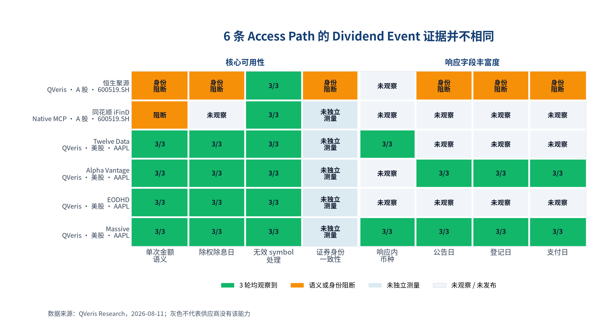
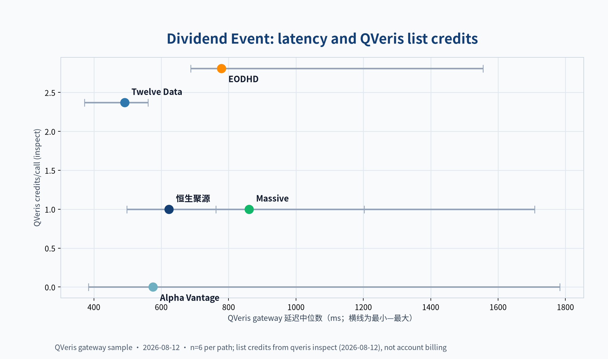
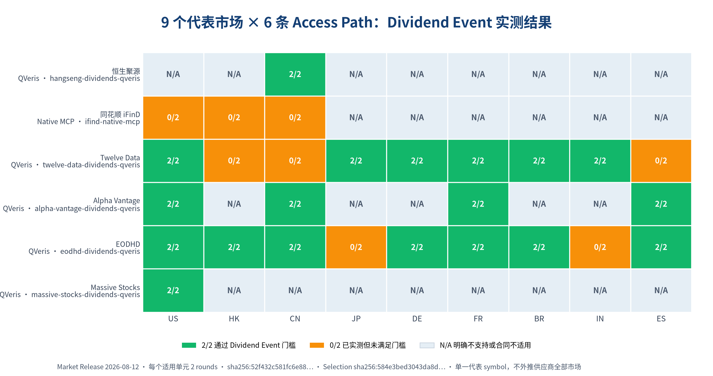

# 2026 年最佳分红数据 API：6 家供应商真实调用、字段差异与 AI Agent 选型指南

如果你的应用需要一条可以直接进入事件日历、收益回测或现金流模型的分红记录，最低要求不是“接口返回了数据”，而是能确认**证券身份、除权除息日和单次每股现金金额**。本次固定样本中，Twelve Data、Alpha Vantage、EODHD 和 Massive 的 QVeris Access Path 连续 3 轮完成了这项任务；恒生聚源的基础样本因证券身份无法确认而保持证据不足；同花顺 iFinD Native MCP 返回年度累计单位分红，但没有形成可绑定日期的单次 Dividend Event。

我们另外对 US、HK、CN、JP、DE、FR、BR、IN、ES 九个代表市场做了两轮复测。这里发布的是**代表市场样本结果**，不是供应商全部证券和历史区间的覆盖承诺。

> **快速建议**：只做美股基础分红事件，可以先复测 Twelve Data、Alpha Vantage、EODHD 或 Massive。需要公告日、登记日和支付日，优先看 Alpha Vantage 与 Massive；需要响应明确给出币种，优先看 Twelve Data 与 Massive。跨市场时，EODHD 的代表样本通过 7 个市场，Twelve Data 通过 6 个；Alpha Vantage 的 4 个适用市场全部通过，另外 5 个由 QVeris 明确标为不支持，因此没有重复调用。

## 本文目录

- [实测结论一览](#实测结论一览)
- [开发者怎么选](#开发者怎么选)
- [证据与供应商差异](#证据与供应商差异)
- [Agent 选型时额外检查什么](#agent-选型时额外检查什么)
- [测试方法、复测与贡献](#测试方法复测与贡献)
- [限制、披露与更正](#限制披露与更正)
- [常见问题](#常见问题)

## 实测结论一览

基础测试日期为 2026-08-11：每条适用 Access Path 包含一个正向证券样本和一个无效 symbol 负向控制，各执行 3 轮，共 36 次真实调用。市场补充测试日期为 2026-08-12：27 个适用正向单元与 6 条路径的负向控制各执行 2 轮，共 66 次真实调用。两份 Release 独立计数，不合并成一个总分。

| 供应商与 Access Path | 本次 Dividend Event 样本结论 | QVeris gateway 延迟中位数 / QVeris Inspect 公开标价 | Native 官方价格入口 | 9 个代表市场样本 |
|---|---|---:|---|---|
| [恒生聚源](https://www.gildata.com/products/core-data.html)（QVeris）· [Try it in QVeris](https://qveris.ai/providers/hangseng_polysource) | **证据不足**：基础样本有日期和金额，但返回证券身份无法确认；修正后的 CN 新样本通过（2/2） | 623 ms / 1 credit/call | 未公开标准价，商务询价 | CN 通过（2/2）；其余 8 个未测试：明确不适用 |
| [同花顺 iFinD](https://mcp.51ifind.com/gwstatic/static/ds_web/ifind-mcp-web/skills/SKILL_INSTALL_GUIDE.md)（Native MCP） | **本次样本未通过**：缺少单次事件日期，年度累计值也不能证明本次事件金额 | 不适用，Native MCP 不混入 QVeris 指标 | 个人版 CNY 40/月起，5,000 次请求 | US、HK、CN 本次代表样本未通过（0/2）；其余 6 个未测试：明确不适用 |
| [Twelve Data](https://twelvedata.com/docs#dividends)（QVeris）· [Try it in QVeris](https://qveris.ai/providers/twelvedata) | **本次样本通过**：AAPL 三轮均返回除权除息日和单次金额；无效 symbol 三轮均未产生伪事件 | 491 ms / 2.37 credits/call | Grow USD 29/月起；免费层 800 credits/日 | 6 个市场通过（2/2）；HK、CN、ES 本次代表样本未通过（0/2） |
| [Alpha Vantage](https://www.alphavantage.co/documentation/#dividends)（QVeris）· [Try it in QVeris](https://qveris.ai/providers/alphavantage) | **本次样本通过**：AAPL 正向样本与无效 symbol 控制均连续三轮满足门槛 | 576 ms / 0 credits/call | Premium USD 49.99/月起；免费层 25 次/日 | 4 个适用市场通过（2/2）；5 个未测试：明确不适用 |
| [EODHD](https://eodhd.com/financial-apis/api-splits-dividends/)（QVeris）· [Try it in QVeris](https://qveris.ai/providers/eodhd) | **本次样本通过**：AAPL 正向样本与无效 symbol 控制均连续三轮满足门槛 | 779 ms / 2.81 credits/call | All-in-One USD 99.99/月 | 7 个市场通过（2/2）；JP、IN 本次代表样本未通过（0/2） |
| [Massive](https://massive.com/docs/rest/stocks/corporate-actions/dividends)（QVeris）· [Try it in QVeris](https://qveris.ai/providers/massive_stocks) | **本次样本通过**：AAPL 正向样本与无效 symbol 控制均连续三轮满足门槛 | 861 ms / 1 credit/call | [Stocks Basic Free](https://massive.com/pricing?product=stocks)；Dividend endpoint 包含在所有 Stocks plans | US 通过（2/2）；其余 8 个未测试：明确不适用 |

这四种公开状态只描述证据，不代替采购结论：

- **本次样本通过**：冻结输入的全部轮次都完成了当前 CAP 定义的任务。
- **本次样本未通过**：已经真实调用，但结果缺少必要语义或字段。
- **证据不足**：响应可能包含有用字段，但当前证据不能证明它可以安全使用。
- **未测试：明确不适用**：QVeris 或 Access Path 合同已明确不支持，因此没有浪费调用继续探测。

“本次样本通过”不等于生产 SLA，也不代表所有证券、市场、日期范围和授权场景都可用。

## 开发者怎么选

### 只需要美股除权除息日和单次金额

Twelve Data、Alpha Vantage、EODHD 和 Massive 都进入优先复测名单。选择时再看三个工程维度：你的目标字段、QVeris 单次标价，以及在部署区域内重新测得的 P95/P99 延迟。

### 需要公告日、登记日和支付日

优先复测 Alpha Vantage 和 Massive，因为这些字段在本次公开样本中实际出现。字段“曾经出现”不等于每条历史记录都完整，生产接入仍应测缺失率和历史深度。

### 必须使用响应内的明确币种

优先核验 Twelve Data 和 Massive。本次样本中它们明确提供了 `currency`；其他路径没有提供时，应保持为空或从另一份有明确来源的数据集补充，不能按交易所静默猜测。

### 主要处理 A 股分红

恒生聚源修正身份提取后的 CN 代表样本通过（2/2），可以作为优先复测候选。但基础三轮样本仍因身份问题保持证据不足；要升级基础结论，需要生成新的三轮 successor release，而不是改写旧证据。iFinD Native MCP 在 CN 两轮仍缺单次事件日期与金额语义。

### 需要一个 key 比较多家数据源

选择 QVeris Access Path，可以减少认证与调用协议差异。统一 key 不会自动统一供应商的字段语义，因此证券身份、日期和金额仍需按照同一个 CAP 规则验证。

## 证据与供应商差异

### 为什么 Dividend Event 比“查分红”更难

一个可用于程序处理的分红事件至少要回答四件事：是哪只证券、何时除息、单次每股金额是多少、这次响应到底是“没有事件”还是“请求失败”。公告日、登记日和支付日是很有价值的扩展字段，但不能替代除权除息日。币种没有出现在响应里时，也不能根据市场自行补全。

同一证券在不同接口中还可能采用 `AAPL`、`600519.SH` 或供应商内部标识。日期和金额看起来都正确，只要返回证券不能与请求证券对应，整条记录就不能安全进入数据库、回测或 Agent 上下文。

### 核心能力和字段丰富度怎么看

[](capability-seo/best-dividend-apis/charts/dividend-evidence-heatmap.png)
<p align="center"><sub>点击查看高分辨率原图；图中每个状态都来自基础 Release 的公开事实</sub></p>

这张图分成两个区域：左侧“核心可用性”回答一条记录能不能完成 Dividend Event 任务；右侧“响应字段丰富度”只展示币种、公告日、登记日和支付日等附加信息。字段丰富不等于记录可用：只要证券身份或金额语义被阻断，附加字段再多也不能直接采信。

- 绿色 `3/3`：固定样本三轮都观察到该能力。
- 橙色“阻断”：字段可能已经出现，但身份或业务语义不可信。
- 蓝色“未独立测量”：当前公开证据不能单独证明这一维；未独立测量不等于失败。
- 灰色“未观察”：本次响应没有看到该字段，不代表供应商永远不提供。

因此，这张图不能被读成总分或供应商排名。它的用途是告诉开发者：哪一个风险必须在自己的复测中继续验证。

### 实测延迟与 QVeris 公开标价

[](capability-seo/best-dividend-apis/charts/dividend-runtime-tradeoff.png)

横轴是 QVeris gateway 延迟中位数，横线是本次六次调用的最小—最大值；纵轴是 `qveris inspect` 返回的公开标价，不是当前账号实际扣费。测试账号存在折扣，账号实际扣费不能用于公开选型，因此本文不发布它，也不把它当作价格证据。

本次样本中 Twelve Data 延迟中位数最低；恒生聚源和 Massive 的 Inspect 标价最低；EODHD 的标价和观测延迟都更高。六次调用只能用于确定复测顺序，不能预测生产流量下的地域差异、P95/P99 或 Native API SLA。

### Native 套餐和 QVeris credits 是两种价格

| Provider / Access Path | 免费或试用入口 | 付费入口 | 价格证据作用域 |
|---|---|---|---|
| [恒生聚源 / QVeris](https://www.gildata.com/products/core-data.html) | `Not published for this snapshot.` | `Commercial; see product page.` | 供应商产品页；QVeris 标价另见 Inspect snapshot |
| [同花顺 iFinD / Native MCP](https://mcp.51ifind.com/?syncCookieTimes=1#/pricing) | `New accounts receive 2,000 trial requests` | `Personal CNY 40/month for 5,000 requests; Enterprise CNY 5,000/month for 1,000,000 requests` | 仅 Native MCP |
| [Twelve Data / QVeris](https://twelvedata.com/pricing) | `Basic with 8 API credits per minute and 800 per day` | `Grow from USD 29/month` | Provider-wide 官方价格；QVeris 标价按 Tool 核验 |
| [Alpha Vantage / QVeris](https://www.alphavantage.co/premium/) | `25 API requests per day` | `Premium from USD 49.99/month` | Provider-wide 官方价格；QVeris 标价按 Tool 核验 |
| [EODHD / QVeris](https://eodhd.com/pricing) | `20 API calls per day` | `All-in-One USD 99.99/month` | Provider-wide 官方价格；QVeris 标价按 Tool 核验 |
| [Massive / QVeris](https://massive.com/pricing?product=stocks) | `Stocks Basic Free` | `Stocks Starter USD 29/month` | 官方文档声明 Dividend endpoint 包含在所有 Stocks plans；QVeris 标价按 Tool 核验 |

供应商套餐、QVeris credits 和测试账号实际扣费是三种不同事实。套餐还可能涉及实时性、交易所费用、缓存和再分发权限，不能只按最低月费排序。

### 九个代表市场的样本结果

[](capability-seo/best-dividend-apis/charts/dividend-market-coverage.png)

图中绿色表示该市场的固定代表 symbol 连续两轮都返回可核验的证券身份、`effective_date` 和 `amount`；橙色表示两轮都执行了，但没有形成合格的 Dividend Event；灰色表示 QVeris 或 Access Path 合同已经明确不适用，因此没有重复探测。

| Provider / Access Path | 通过（2/2）的代表市场 | 本次代表样本未通过（0/2） | 未测试：明确不适用 |
|---|---|---|---|
| 恒生聚源 / QVeris | CN | — | US, HK, JP, DE, FR, BR, IN, ES：合同仅覆盖中国内地交易所 |
| 同花顺 iFinD / Native MCP | — | US, HK, CN：缺单次事件日期与金额语义 | JP, DE, FR, BR, IN, ES：合同只声明 US/HK/CN |
| Twelve Data / QVeris | US, JP, DE, FR, BR, IN | HK, CN, ES | — |
| Alpha Vantage / QVeris | US, CN, FR, ES | — | HK, JP, DE, BR, IN：QVeris 明确不支持 |
| EODHD / QVeris | US, HK, CN, DE, FR, BR, ES | JP, IN | — |
| Massive / QVeris | US | — | HK, CN, JP, DE, FR, BR, IN, ES：Stocks Access Path 仅适用于美国股票 |

`2/2` 是重复性证据，不是统计意义上的全市场认证；`0/2` 只说明所选 symbol 和窗口连续两轮没有完成任务，不能据此断言供应商完全不支持该市场。要进入生产，应把自己的 symbol、权限、日期范围和授权条件带入同一套复测。

市场 Release 共包含 120 个 frozen cells：66 个适用单元都有公开脱敏 terminal，54 个明确不适用单元保留冻结原因。未知、临时失败或缺少证据不能被改写成不适用。

### 六家供应商逐一分析

#### 恒生聚源：CN 新证据已闭环，旧结论不改写

基础样本的提取器误把内部 `stockobject` 当作证券代码，因此尽管日期和金额存在，证券身份仍无法确认。市场补充套件改为优先读取响应 `stockcode`，CN 两轮均完成映射。它可以成为 A 股复测候选，但基础三轮结论升级仍需新的 successor release。

#### 同花顺 iFinD：年度累计值不能替代单次事件

iFinD Native MCP 三轮都返回年度累计单位分红，但没有可核验的除权除息日。年度累计值不能证明某次事件的金额，因此不适用于本文定义的事件日历、除息日回测或价格调整任务。本次只评测官方 Native MCP，不提供 QVeris CTA。

#### Twelve Data：核心字段直接，并明确返回币种

本次 AAPL 样本提供 `effective_date`、`amount` 和 `currency`，适合作为美股基础分红日历或事件提醒的复测候选。分页上限、全市场范围和套餐限额尚未独立验证。

#### Alpha Vantage：样本中的事件日期更丰富

除最低字段外，本次样本还出现公告日、登记日和支付日，适合需要多阶段事件模型的开发者优先复测。这只证明固定 AAPL 样本中出现了这些字段，不代表所有记录都完整。

#### EODHD：核心字段通过，数据形状精简

公开事实包含除权除息日、金额和事件数量，没有据此推断币种或其他日期。只需要标准化核心事件时它是候选；如果业务依赖公告日、支付日或币种，应把这些字段加入自己的验收测试。

#### Massive：字段丰富，官方 Stocks 套餐入口明确

本次样本同时提供币种、公告日、登记日、除权除息日和支付日。Massive 官方文档还将 Dividend endpoint 列为所有 Stocks plans 可用，个人开发者可从 Stocks Basic Free 开始核验；通过 QVeris 调用时则以对应 Tool 的 1 credit/call Inspect 标价为准。

## Agent 选型时额外检查什么

本文没有执行 Agent Trial，也不做综合 Agent 评级。对 Agent 来说，字段多并不是唯一标准；身份来源、错误语义和缺失值处理往往更容易造成静默错误。

| Provider 与 Access Path | 必需事件字段 | 证券身份 | 无效 symbol | 响应内币种 | 附加事件日期 |
|---|---|---|---|---|---|
| 恒生聚源（QVeris） | 基础样本被身份门禁阻断；新 CN 样本通过（2/2） | 新套件已用响应 `stockcode` 映射验证 | 3/3 正确处理 | 未观察到 | 公告日、登记日、支付日 |
| 同花顺 iFinD（Native MCP） | 缺单次金额语义与除权除息日 | 身份一致性未独立测量 | 3/3 正确处理 | 未发布 | 未形成单次事件日期组 |
| Twelve Data（QVeris） | 3/3 | 身份一致性未独立测量 | 3/3 正确处理 | `USD` | 本次仅发布除权除息日 |
| Alpha Vantage（QVeris） | 3/3 | 身份一致性未独立测量 | 3/3 正确处理 | 未观察到 | 公告日、登记日、支付日 |
| EODHD（QVeris） | 3/3 | 身份一致性未独立测量 | 3/3 正确处理 | 未观察到 | 本次仅发布除权除息日 |
| Massive（QVeris） | 3/3 | 身份一致性未独立测量 | 3/3 正确处理 | `USD` | 公告日、登记日、支付日 |

选型时应分别检查参数清晰度、schema 稳定性、错误恢复、分页、身份来源和单工具完成能力。当前 Release 只充分观察了必需字段和无效 symbol；参数清晰度、分页和 Agent Trial 没有足够证据，因此保持未测量，而不是合成一个主观总分。

公开事实中的规范化 symbol 可能来自请求输入回填，不能单独证明响应身份一致。只有保留供应商返回标识的来源，并完成 canonical symbol 映射，才能把这一维判为通过。无效 symbol 三轮正确处理也不代表已经覆盖限流、超时、认证过期和服务端异常。

## 测试方法、复测与贡献

### 我们怎么测试

- **正向样本**：美股基础路径使用 `AAPL`，A 股基础路径使用 `600519.SH`，并固定历史时间窗。
- **最低门槛**：证券身份可核验，同时存在除权除息日 `effective_date` 和数值有效的单次每股现金分红 `amount`。
- **负向控制**：使用明确无效的 symbol，接受空态或可归因的供应商拒绝，不接受编造的分红事件。
- **基础重复性**：每个适用用例连续执行 3 轮；Direct Test 是强制项。
- **市场补充**：九个市场各固定一个代表 symbol，每个适用单元执行 2 轮。
- **证据处理**：原始响应默认私有，只公开通过脱敏和授权检查的终态事实及 digest。

两轮市场测试适合验证确定性接口在固定样本上的重复性，但不足以证明完整市场覆盖。明确不支持的市场不再重复探测；没有明确合同结论的市场不能因为缺少证据而记为不适用。

### 不需要 key：离线复核公开 Release

离线 replay 会验证 run plan、终态 cells、公开 terminal、suite fingerprint 和 Release 字节是否一致。它证明发布物没有被悄悄改写，不证明供应商今天仍返回相同结果。

```bash
uv sync --locked --all-groups
uv run qveris-bench release replay releases/dividend-events-2026-q3-v1 \
  --expected-digest sha256:ff44f0d4aa72553949d93910c78af57c29bf46dc39a206aacb97956a081049e0
uv run qveris-bench release replay \
  releases/dividend-events-market-coverage-2026-q3-v1 \
  --expected-digest sha256:52f432c581fc6e8868e9070be21ad1b210b59238fb4c26d252f2a13a2d93f70e
```

可以检查[基础 Release](../../releases/dividend-events-2026-q3-v1/release.json)、[市场 Release](../../releases/dividend-events-market-coverage-2026-q3-v1/release.json)、[Selection Snapshot](capability-seo/best-dividend-apis/selection-snapshot.json)、[基础公开证据](../../evidence/dividend-events-2026-q3-v1/)、[市场公开证据](../../evidence/dividend-events-market-coverage-2026-q3-v1/)和[离线 replay 说明](../release-replay.md)。图中的绿色或橙色市场单元都能沿 digest 找到对应 terminal。

### 有 key：重新执行真实调用

[Dividend Events live workflow](../../.github/workflows/live-dividend-events-e2e.yml)将基础 binding 分 3 轮执行；[Market workflow](../../.github/workflows/live-dividend-market-coverage-e2e.yml)将适用 binding 分 2 轮执行：

- 五条 QVeris Access Path 使用 `QVERIS_API_KEY`；
- 同花顺 iFinD 只使用 `IFIND_MCP_API_KEY`，走 Native MCP；
- 凭证通过环境变量或 GitHub Actions secrets 注入，不能写入 fixture、日志或 PR。

新的真实执行不会覆盖历史 Release。输入、规则或结果变化时，创建 successor release 并保留旧版 digest。

### 供应商与开发者如何参与

供应商可以提交 [Provider submission](https://github.com/QVerisAI/qveris-capability-benchmarks/issues/new?template=provider-submission.yml)，说明 Provider、Access Path、官方接口、授权范围和希望参与的能力。API key 和私有响应不能进入 Issue 或 PR，凭证通过安全渠道处理。

开发者可以贡献 [CAP 与方法提案](https://github.com/QVerisAI/qveris-capability-benchmarks/issues/new?template=cap-method-proposal.yml)，包括边界用例、负向控制、字段规则和可授权来源。认为结果有误时，可以提交带 Release digest 与反证的 [Result challenge](https://github.com/QVerisAI/qveris-capability-benchmarks/issues/new?template=result-challenge.yml)。供应商可以更正事实，但不能购买纳入、结论或排序。

## 限制、披露与更正

- 本文只测试 Dividend Events 这一项能力，不代表供应商的综合金融数据质量。
- 基础样本只覆盖 `AAPL`、`600519.SH` 和无效 symbol；市场套件每个市场只使用一个代表 symbol。
- `2/2` 与 `3/3` 是固定样本重复性，不是全量证券覆盖率或统计置信区间。
- 明确不适用的市场没有重复调用；未知、临时失败或缺少证据不能改写成不适用。
- QVeris gateway 延迟只描述本次 Access Path 小样本，不能归因于供应商 Native API。
- QVeris credits 来自 2026-08-12 的 Inspect 公开标价；测试账号实际扣费不进入公开比较。
- Native 套餐来自供应商官方页面，正式采购前应复核额度、实时性、交易所费用、缓存和再分发权限。
- QVeris 运营平台参与部分 Access Path 的接入，但测试规则、终态证据和复测入口公开；本文不接受付费排名。
- 恒生聚源修正后的 CN 新证据为 2/2，基础三轮样本仍保留原结论；历史 Release 不原地修改。

完整规则见[评测方法论](_shared/benchmark-methodology.md)和 [QVeris Capability Benchmarks](https://github.com/QVerisAI/qveris-capability-benchmarks)。还可以阅读 [Market data API for AI agents](https://qveris.ai/guides/market-data-api-for-ai-agents/)、[AI stock research agent](https://qveris.ai/guides/ai-stock-research-agent/)与 [Best Free Stock APIs](https://qveris.ai/guides/stock-api-free-comparison/)。

## 常见问题

### 哪个分红数据 API 最适合开发者？

没有脱离需求的统一答案。只需要美股除权除息日和单次金额时，Twelve Data、Alpha Vantage、EODHD 和 Massive 都是复测候选；需要完整日期组可优先看 Alpha Vantage 或 Massive；需要明确币种可优先看 Twelve Data 或 Massive。

### “本次样本通过”是否代表数据绝对完整？

不代表。它只表示冻结 symbol、时间窗和轮次完成了当前 Dividend Event 任务。所有历史事件、全市场证券和持续 SLA 需要独立证据。

### `0/2` 是否代表这个市场不支持？

不代表。它表示选定代表 symbol 在固定窗口连续两轮没有返回合格事件。可能原因包括接口确实不覆盖、symbol 方言不同、权限限制或该窗口的数据行为；只有明确的官方或 Access Path 合同结论才会写成不适用。

### 为什么 iFind 返回年度累计单位分红仍然没有通过？

本文测的是单次 Dividend Event。年度累计单位分红不能证明某次事件的金额，也没有对应的除权除息日，无法安全用于除息日回测、价格调整或事件提醒。

### 可以直接比较表中的延迟吗？

可以在同一 QVeris gateway 边界和观察窗口内用于第一轮复测排序，但不能把六次调用的中位数当作 Native API 性能排名或 SLA。正式选型还应补测目标地域和并发下的 P95/P99。

### 我能用自己的 API key 复测吗？

可以。QVeris 已接入的供应商使用一个 `QVERIS_API_KEY`；iFind 使用自己的 Native MCP key。复测应保留相同输入、规则和轮次，结果变化时创建新的 Release，而不是覆盖旧证据。
