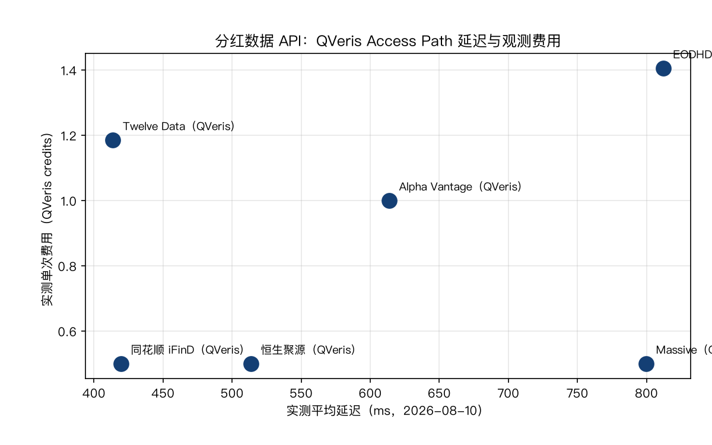
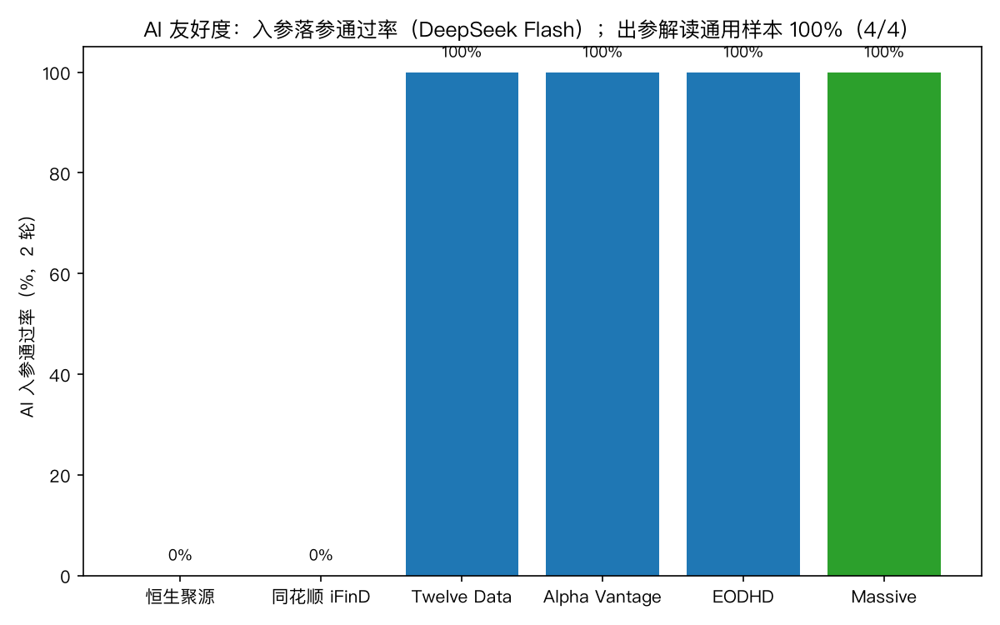
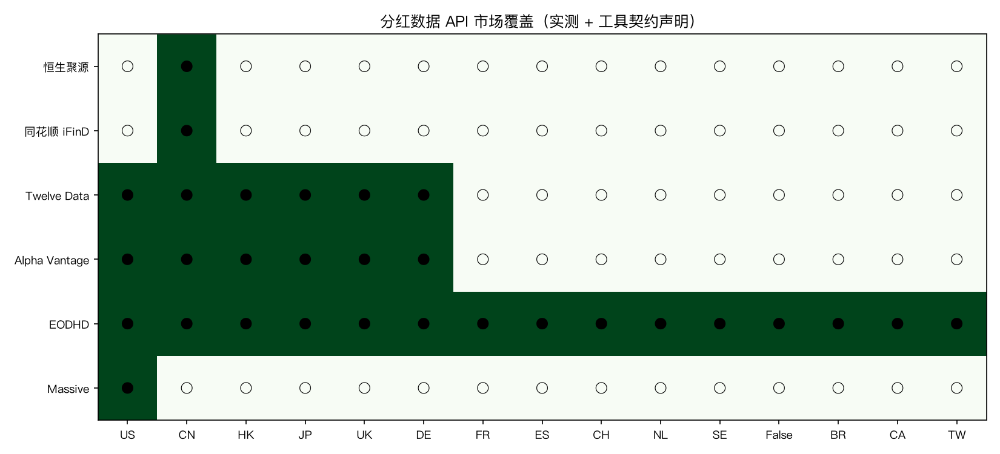

# 2026 分红数据 API 对比：6 家分红与除权数据源实测

快速结论：

- 直接回答：本平台 Direct Test 实测（2026-08-09，固定用例 2 轮）中，EODHD、Twelve Data、Alpha Vantage、Massive（原 Polygon.io）、恒生聚源、同花顺 iFinD 6 家全部通过分红数据核心用例。A 股场景恒生聚源与同花顺 iFinD 单次 0.50 credits 成本最低；海外场景 Twelve Data 与 Alpha Vantage 实测延迟最低（约 0.5–0.6 秒）。
- AI 友好度（实测）：四家海外工具（EODHD、Twelve Data、Massive、Alpha Vantage）AI 落参 2/2 轮全对；恒生聚源与同花顺 iFinD 各 0/2——恒生未用标准代码 `600519.SH`，iFinD 把 `period` 填成 `year`/`年报`（契约要求 `annual/H1/Q3/Q1`，会导致真实调用失败）。出参解读 4/4（AI 能正确读出分红金额、除息日与美元单位，负向输入正确报"无数据"）。
- 重要说明：本文延迟与费用为 2026-08-09 经 QVeris 网关由本平台实测，不代表供应商直连指标；结论全部来自本平台 Direct Test 与 AI 探针，第三方评估快照仅作候选参考。

## 哪个分红数据 API 最适合你的场景？

做 A 股分红与送转数据：恒生聚源与同花顺 iFinD 都通过核心用例、单次 0.50 credits，但两者 AI 落参实测均未通过（代码方言与 period 枚举），Agent 自动调用需要规范化兜底。

做美股或全球市场的分红历史：Twelve Data 实测延迟 0.6 秒、单次 1.19 credits；Alpha Vantage 实测延迟 0.5 秒、单次 1.00 credits；Massive 单次 0.50 credits 最低但实测延迟 1.0 秒最高。

## 6 家分红数据 API 对比（2026 年 8 月实测）

结论为本平台 Direct Test 实测（2026-08-09）：固定用例（AAPL 分红历史检索、无效代码负向控制）经 QVeris 真实执行，每个适用单元 2 轮；延迟与费用为本次执行的平均值。供应商候选来自 Harbor 覆盖快照（仅作参考）。同一法律实体只占一行（Massive 与 Polygon.io 同源合并，恒生聚源 REST 与 MCP 路径同源合并）。

| 供应商 | 实测延迟 | 实测单次费用（QVeris credits） | Direct Test | AI 落参（2 轮） | 市场侧重 | 链接 |
|---|---|---|---|---|---|---|
| [恒生聚源](https://www.gildata.com/) · [在 QVeris 中试用](https://qveris.ai/providers/hangseng_polysource) | 0.6s | 0.50 | 合格 | 0/2 | A 股 | [中国](https://qveris.ai/providers/hangseng_polysource) |
| [同花顺 iFinD](https://quantapi.51ifind.com/) · [在 QVeris 中试用](https://qveris.ai/providers/ths_ifind) | 0.5s | 0.50 | 合格 | 0/2 | A 股 | [中国](https://qveris.ai/providers/ths_ifind) |
| [Twelve Data](https://twelvedata.com/) · [在 QVeris 中试用](https://qveris.ai/providers/twelvedata) | 0.6s | 1.19 | 合格 | 2/2 | 全球 | [全球](https://qveris.ai/providers/twelvedata) |
| [Alpha Vantage](https://www.alphavantage.co/) · [在 QVeris 中试用](https://qveris.ai/providers/alphavantage) | 0.5s | 1.00 | 合格 | 2/2 | 美股/全球 | [美国/全球](https://qveris.ai/providers/alphavantage) |
| [EODHD](https://eodhd.com/) · [在 QVeris 中试用](https://qveris.ai/providers/eodhd) | 0.8s | 1.41 | 合格 | 2/2 | 全球 | [全球](https://qveris.ai/providers/eodhd) |
| [Massive（原 Polygon.io）](https://massive.io/) · [在 QVeris 中试用](https://qveris.ai/providers/massive_stocks) | 1.0s | 0.50 | 合格 | 2/2 | 美股 | [美国](https://qveris.ai/providers/massive_stocks) |

综合判断：A 股分红与送转数据，恒生聚源与同花顺 iFinD 是首选（成本最低、通过核心用例），但需要自己处理 AI 落参的代码/枚举方言；全球分红历史，Twelve Data 与 Alpha Vantage 延迟与成本均衡；Massive 最便宜但延迟最高，适合低频查询。

除本短名单外，如需继续考察更多候选，可在 [QVeris Provider Hub](https://qveris.ai/discover?view=providers) 浏览全部金融数据供应商。

## 测试方法与证据分级

- Direct Test（合格/未完全达标）：本平台 2026-08-09 实测。固定用例（AAPL 分红历史检索、无效代码负向控制）经 QVeris 真实执行，每个适用单元 2 轮，按分红契约必填字段判定。
- AI 落参（入参）：2026-08-09 用 DeepSeek Flash 对每家 canonical 工具做固定提问，每个工具 2 轮，检查只调该工具、必填参数齐全、参数类型合法、不幻觉多余参数、语义正确。
- AI 出参解读：2026-08-09 用 DeepSeek Flash 对冻结的真实分红响应做解读（正向提取 + 负向空态），每用例 2 轮。
- 官方来源：各供应商深度解析中链接的官方文档与产品页。
- 编辑解读：基于实测结果与供应商公开契约得出的买方建议，仅限本快照时点。

## 达标标准：什么算"合格"

- 合格：固定用例下，分红契约的必填观察字段（除息日、每股分红金额、币种等）全部返回且取值合法；无效代码负向控制返回空态或明确报错，不编造分红记录；2 轮结果稳定。
- 未测：该供应商无 QVeris canonical 分红工具或本轮未授权，不计分。

本版 6 家供应商全部通过核心用例；Financial Modeling Prep 与雅虎财经本轮未测：FMP 在 QVeris 注册表中只有复权价格类工具、没有分红事件列表工具（其自家分红接口尚未接入 QVeris）；雅虎财经没有独立的分红事件接口。两者均为工具覆盖缺口，不代表数据能力结论，接入后可复测。

## AI 友好度：AI 能不能自己把活干成

AI 友好度测的是"把同一个自然语言任务交给 AI，AI 能不能自己完成整个工具调用闭环"，分两步：

1. **入参落参**：AI 读到问题后，能不能按工具契约填对调用参数（不换工具、必填齐全、不幻觉多余参数、代码语义正确）。
2. **出参解读**：工具返回数据后，AI 能不能正确读出答案（金额、日期、单位），不添油加醋；负向输入不编造。

两步都过才算"AI 友好"；任何一步失败都意味着 Agent 自动调用需要人工兜底。

**一个完整的例子（Twelve Data 分红工具，DeepSeek Flash）**：

- 提问："AAPL 最近一次每股分红金额和除息日是什么？"
- 入参：AI 填 `{"symbol": "AAPL"}` → 工具返回 `dividends: [{"ex_date": "2026-05-11", "amount": 0.27}, ...]`
- 出参：AI 回答"最近一次每股 0.27 美元，除息日 2026-05-11"——金额、日期、美元单位全部正确，且没有添加响应中不存在的股票或日期

### 入参落参（2 轮）

| 供应商 | AI 落参（2 轮） | 实测说明 |
|---|---|---|
| EODHD | 2/2 | `symbol=AAPL` 正确 |
| Twelve Data | 2/2 | `symbol=AAPL` 正确 |
| Massive | 2/2 | `ticker=AAPL` 正确 |
| Alpha Vantage | 2/2 | `function=DIVIDENDS`、`symbol=AAPL` 正确 |
| 恒生聚源 | 0/2 | 未用标准代码 `600519.SH`（一轮填裸代码 `600519`，一轮填名称） |
| 同花顺 iFinD | 0/2 | `codes` 漏 `.SH` 后缀；`period` 填成 `year`/`年报`，契约要求 `annual/H1/Q3/Q1`——会导致真实调用失败 |

### 出参：AI 能否正确解读工具响应（2 轮）

以 Twelve Data 真实分红响应为冻结样本：AI 正确读出最近一次每股分红 0.27 美元、除息日 2026-05-11，且不添加响应中不存在的股票或日期（2/2）；负向样本（无效代码返回空列表）正确报告"无分红记录"，不编造金额（2/2）。出参解读为通用算子验证，各家逐测将在后续版本补齐。

## 市场覆盖

覆盖判定原则：以工具 SV 结果（claimed_markets + 逐市场探测）为准。当前 MKT.DIVIDENDS 在 Harbor 尚无 SV 探测记录，本版使用 QVeris 工具注册表的 claimed market 标签（EODHD、Twelve Data、Alpha Vantage）+ 官方声明（Massive 美股；恒生聚源与同花顺 iFinD 为 A 股）作为过渡口径，● = 已声明覆盖，○ = 未声明覆盖。覆盖范围不等于响应质量；SV 逐市场探测待补后以探测结果为准。

| 供应商 | US | CN | HK | JP | UK | DE | FR | ES | CH | NL | SE | NO | BR | CA | TW |
|---|---|---|---|---|---|---|---|---|---|---|---|---|---|---|
| EODHD | ● | ● | ● | ● | ● | ● | ● | ● | ● | ● | ● | ● | ● | ● | ● |
| Twelve Data | ● | ● | ● | ● | ● | ● | ○ | ○ | ○ | ○ | ○ | ○ | ○ | ○ | ○ |
| Alpha Vantage | ● | ● | ● | ● | ● | ● | ○ | ○ | ○ | ○ | ○ | ○ | ○ | ○ | ○ |
| Massive（原 Polygon.io） | ● | ○ | ○ | ○ | ○ | ○ | ○ | ○ | ○ | ○ | ○ | ○ | ○ | ○ | ○ |
| 恒生聚源 | ○ | ● | ○ | ○ | ○ | ○ | ○ | ○ | ○ | ○ | ○ | ○ | ○ | ○ | ○ |
| 同花顺 iFinD | ○ | ● | ○ | ○ | ○ | ○ | ○ | ○ | ○ | ○ | ○ | ○ | ○ | ○ | ○ |

说明：EODHD 声明覆盖 14 个市场（含欧洲多国、巴西、加拿大、台湾），是短名单中最广的；Twelve Data 与 Alpha Vantage 声明 6 个市场；Massive、恒生聚源、同花顺 iFinD 分别聚焦美股与 A 股。以上为 claimed 口径，SV 探测补跑后可能收缩（参考公司行动 CAP 中 Alpha Vantage 声明 US/GLOBAL 但多市场探测失败）。

## 按使用场景选择分红数据 API

### A 股分红与送转方案

恒生聚源与同花顺 iFinD 均通过核心用例、单次 0.50 credits；iFinD 数据含每股派现、送转比例与公告日期，字段更完整。两者 AI 落参均需兜底：iFinD 的 `period` 枚举（annual/H1/Q3/Q1）和代码后缀是 AI 高频踩坑点。

### 美股分红历史

Alpha Vantage 实测延迟最低（0.5 秒）；Twelve Data 响应结构清晰（meta + dividends 数组）且 AI 出参解读全过；Massive 单次成本最低（0.50 credits）。

### 低成本批量查询

恒生聚源、iFinD、Massive 均为单次 0.50 credits；海外批量场景 Massiv 最低，A 股场景恒生/iFinD 最低。

## 供应商深度解析

**恒生聚源 —— A 股分红数据完整，AI 落参需兜底**：官方产品页见[聚源基础数据库](https://www.gildata.com/products/core-data.html)。实测延迟 0.6 秒、单次 0.50 credits、Direct Test 4/4 通过，覆盖 A 股分红与送转。AI 落参 0/2：模型未使用标准代码 `600519.SH`（一轮裸代码、一轮名称），Agent 自动调用需代码规范化。

**同花顺 iFinD —— 字段最全，period 枚举是 AI 陷阱**：官方站点：[iFinD 量化数据 API](https://quantapi.51ifind.com/)。实测延迟 0.5 秒、单次 0.50 credits、Direct Test 4/4 通过，返回每股派现（贵州茅台 2025 年度每股 28.02 元）与送转比例。AI 落参 0/2：`codes` 漏 `.SH` 后缀、`period` 填了契约不存在的 `year`/`年报`——这是真实调用失败点。

**Twelve Data —— 响应结构清晰，AI 双向友好**：官方文档：[Twelve Data API](https://twelvedata.com/docs)。实测延迟 0.6 秒、单次 1.19 credits、Direct Test 4/4；AI 落参 2/2、出参解读 4/4（冻结样本），是目前 AI 双向最友好的海外选项。

**Alpha Vantage —— 延迟最低，AI 落参正确**：官方文档：[Alpha Vantage 文档](https://www.alphavantage.co/documentation/)。实测延迟 0.5 秒（短名单最低）、单次 1.00 credits、Direct Test 4/4；AI 落参 2/2（`function=DIVIDENDS` + `symbol=AAPL`）。

**EODHD —— 全球覆盖，成本略高**：官方文档：[EODHD 金融 API](https://eodhd.com/financial-apis/)。实测延迟 0.8 秒、单次 1.41 credits（短名单最高）、Direct Test 4/4；AI 落参 2/2。适合"一个连接器覆盖多市场报价、历史与分红"的场景。

**Massive（原 Polygon.io）—— 最便宜，延迟最高**：官方网站：[Massive](https://massive.io/)。实测延迟 1.0 秒（短名单最高）、单次 0.50 credits、Direct Test 4/4；AI 落参 2/2。适合低频分红查询与历史回溯。

## 局限与时效

- 本版 Direct Test 为 2 个固定用例 × 2 轮的核心字段冒烟（分红历史检索 + 无效代码负向控制），不是分红全量场景认证。
- 延迟与费用为 2026-08-09 经 QVeris 网关的单次实测平均值，不代表供应商直连或 p95 表现；会随套餐、路由与市场状况变化。
- AI 落参结果仅基于 DeepSeek Flash 单模型；出参解读以 Twelve Data 响应为样本，各家逐测待补齐。
- 市场覆盖本版为 claimed 口径（注册表标签 + 官方声明），MKT.DIVIDENDS 尚无 SV 逐市场探测；探测补跑后以 SV 结果为准，未声明市场不代表一定不可用。
- Financial Modeling Prep 与雅虎财经本轮未测：FMP 无分红事件列表工具（自家分红接口未接入 QVeris），雅虎无独立分红事件接口。

## 如何选择

1. 先确定市场：A 股（恒生聚源/iFinD）还是全球（Twelve Data/Alpha Vantage/EODHD/Massive）。
2. 确认需要的字段：除息日、每股派现金额、送转比例、公告日期、币种。
3. 若 Agent 自动调用：优先 AI 落参达标的供应商，或为 A 股两家补代码/枚举规范化兜底。
4. 用自己的真实标的跑两轮冒烟测试，核对字段后再投入生产。

## 常见问题

**本次测试中哪家分红数据 API 最好？** 没有普遍最优：A 股首选恒生聚源与同花顺 iFinD（成本最低、通过核心用例，但 AI 落参需兜底）；全球场景 Twelve Data 与 Alpha Vantage 延迟与 AI 友好度表现最好。

**哪个最便宜？** 恒生聚源、同花顺 iFinD、Massive 均为单次 0.50 credits。

**AI 自动调用选哪家？** 海外四家 AI 落参 2/2 全对；A 股两家需要代码规范化（`600519.SH`）和 period 枚举（annual/H1/Q3/Q1）兜底。

**这次测试和第三方评估快照有什么关系？** 结论全部来自本平台 Direct Test 与 AI 探针；第三方快照只用于构建候选名单和异常对比，不作为发布依据。

## 更正与复测

我们只发布可复现的实测结论，并保留全部固定输入用例。若你是供应商并认为某行不准确，请提交带可复现用例的事实更正；入选与排名均不可购买。

相关指南：

- [Market data API for AI agents](https://qveris.ai/guides/market-data-api-for-ai-agents/)
- [AI stock research agent](https://qveris.ai/guides/ai-stock-research-agent/)
- [2026 公司行动数据 API 对比](https://github.com/QVerisAI/qveris-capability-benchmarks/pull/74)
