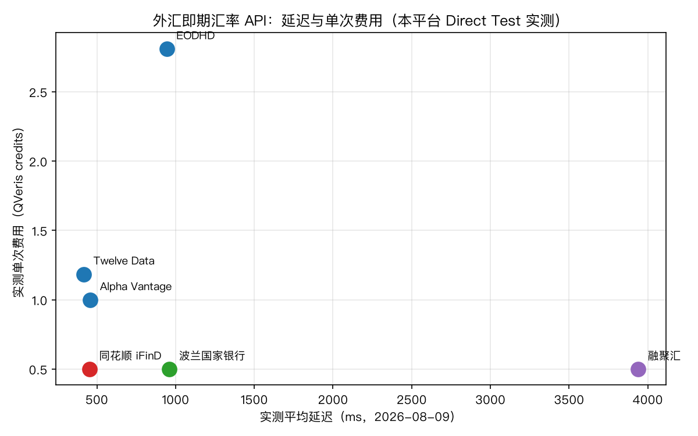
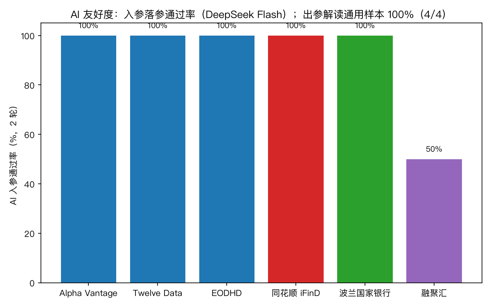
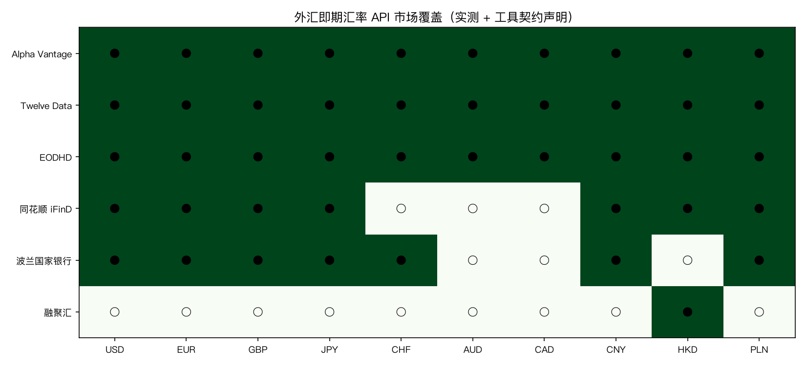

# 2026 外汇汇率 API 对比：6 家即期汇率数据源实测

快速结论：

- 直接回答：本平台 Direct Test 实测（2026-08-09，固定用例 2 轮）中，Alpha Vantage、Twelve Data、EODHD、波兰国家银行、同花顺 iFinD、融聚汇 6 家全部通过外汇即期汇率核心用例（EUR/USD 正向 + 无效币对负向控制）。实测延迟最低的是 Twelve Data（平均 0.4 秒）；单次费用最低的是波兰国家银行、同花顺 iFinD 与融聚汇（正向调用各 1.00 credits）。
- AI 友好度（实测）：Alpha Vantage、Twelve Data、EODHD、波兰国家银行、同花顺 iFinD 五家 AI 落参 2/2 轮全对；融聚汇 1/2（一轮出现多工具调用）。出参解读 4/4（AI 能正确读出汇率、数据更新时间与币对，负向输入正确报"未找到"）。
- 重要说明：本文延迟与费用为 2026-08-09 经 QVeris 网关由本平台实测，不代表供应商直连指标；结论全部来自本平台 Direct Test 与 AI 探针，第三方评估快照仅作候选参考。

## 哪个外汇汇率 API 最适合你的场景？

做交易级的全球即期汇率（需要 bid/ask 与低延迟）：Alpha Vantage 返回买卖价、实测延迟 0.5 秒；Twelve Data 实测延迟最低（0.4 秒）且同时覆盖法币与加密货币。

要官方权威、合规可引用的汇率：波兰国家银行提供官方每日均价（中间价），免费且来源权威，但只覆盖兑波兰兹罗提（PLN）的货币对，没有 bid/ask。

做人民币或中国市场：同花顺 iFinD 实测支持主要交叉币对（USD/CNY、EUR/CNY、EUR/USD、USD/JPY、GBP/JPY、USD/HKD、USD/PLN 等），实测延迟 0.5 秒。

做港股财务折算或港币参考汇率：融聚汇提供港币兑美元的每日参考汇率，实测通过核心用例，但延迟最高（约 3.9 秒）且 AI 落参需兜底。

## 6 家外汇汇率 API 对比（2026 年 8 月实测）

结论为本平台 Direct Test 实测（2026-08-09）：固定用例（EUR/USD 即期汇率检索、无效币对负向控制）经 QVeris 真实执行，每个适用单元 2 轮；延迟与费用为本次执行的平均值（含负向控制，负向调用一般不计费）。供应商候选来自 Harbor 覆盖快照（仅作参考）。同一法律实体只占一行（本版各家均只有一个 canonical 外汇工具）。

| 供应商 | 实测延迟 | 实测单次费用（QVeris credits） | Direct Test | AI 落参（2 轮） | 覆盖侧重 | 链接 |
|---|---|---|---|---|---|---|
| [Alpha Vantage](https://www.alphavantage.co/) · [在 QVeris 中试用](https://qveris.ai/providers/alphavantage) | 0.5s | 1.00 | 合格 | 2/2 | 全球 100+ 法币，含 bid/ask | [美国/全球](https://qveris.ai/providers/alphavantage) |
| [Twelve Data](https://twelvedata.com/) · [在 QVeris 中试用](https://qveris.ai/providers/twelvedata) | 0.4s | 1.19 | 合格 | 2/2 | 全球法币 + 加密货币 | [全球](https://qveris.ai/providers/twelvedata) |
| [EODHD](https://eodhd.com/) · [在 QVeris 中试用](https://qveris.ai/providers/eodhd) | 0.9s | 2.81 | 合格 | 2/2 | 全球多资产（股票/汇率/加密） | [全球](https://qveris.ai/providers/eodhd) |
| [波兰国家银行 NBP](https://api.nbp.pl/en.html) · [在 QVeris 中试用](https://qveris.ai/providers/nbp_pl) | 1.0s | 0.50 | 合格 | 2/2 | 官方均价，兑 PLN | [官方](https://qveris.ai/providers/nbp_pl) |
| [同花顺 iFinD](https://quantapi.51ifind.com/) · [在 QVeris 中试用](https://qveris.ai/providers/ths_ifind) | 0.5s | 0.50 | 合格 | 2/2 | 主要交叉币对（.FX） | [中国](https://qveris.ai/providers/ths_ifind) |
| [融聚汇](http://www.szfiu.com/) · [在 QVeris 中试用](https://qveris.ai/providers/fiu_mcp_server) | 3.9s | 0.50 | 合格 | 1/2 | 港币参考汇率 | [香港](https://qveris.ai/providers/fiu_mcp_server) |

综合判断：全球即期交易场景，Alpha Vantage 与 Twelve Data 是首选（低延迟、含 bid/ask、AI 落参全对）；官方权威场景选波兰国家银行；人民币/中国市场选同花顺 iFinD；港股参考汇率选融聚汇（注意其 AI 落参与延迟）。

除本短名单外，如需继续考察更多候选，可在 [QVeris Provider Hub](https://qveris.ai/discover?view=providers) 浏览全部金融数据供应商。

## 测试方法与证据分级

- Direct Test（合格/未完全达标）：本平台 2026-08-09 实测。固定用例（EUR/USD 即期汇率检索、无效币对负向控制；波兰国家银行为 USD/PLN 官方汇率、融聚汇为 HKD/USD 参考汇率）经 QVeris 真实执行，每个适用单元 2 轮，按外汇契约必填字段判定。
- AI 落参（入参）：2026-08-09 用 DeepSeek Flash 对每家 canonical 工具做固定提问，每个工具 2 轮，检查只调该工具、必填参数齐全、参数类型合法、不幻觉多余参数、语义正确（含各家代码方言）。
- AI 出参解读：2026-08-09 用 DeepSeek Flash 对冻结的真实汇率响应做解读（正向提取汇率与数据时间 + 负向空态），每用例 2 轮。
- 官方来源：各供应商深度解析中链接的官方文档与产品页。
- 编辑解读：基于实测结果与供应商公开契约得出的买方建议，仅限本快照时点。

## 达标标准：什么算"合格"

- 合格：固定用例下，外汇即期契约的必填观察字段（汇率值、币对标识等）全部返回且取值合法；无效币对负向控制返回空态或明确报错，不编造汇率；2 轮结果稳定。
- 未测：该供应商无 QVeris canonical 外汇即期工具或本轮未授权，不计分。

本版 6 家供应商全部通过核心用例；Financial Modeling Prep 与雅虎财经本轮未测：FMP 在 QVeris 注册表中没有外汇汇率工具；Finnhub 只有外汇代码列表工具、没有汇率引用工具。两者均为工具覆盖缺口，不代表数据能力结论，接入后可复测。

## AI 友好度：AI 能不能自己把活干成

AI 友好度测的是"把同一个自然语言任务交给 AI，AI 能不能自己完成整个工具调用闭环"，分两步：

1. **入参落参**：AI 读到问题后，能不能按工具契约填对调用参数（不换工具、必填齐全、不幻觉多余参数、代码方言正确）。
2. **出参解读**：工具返回数据后，AI 能不能正确读出答案（汇率、币对、数据时间），不添油加醋；负向输入不编造。

两步都过才算"AI 友好"；任何一步失败都意味着 Agent 自动调用需要人工兜底。

**一个完整的例子（Alpha Vantage 汇率工具，DeepSeek Flash）**：

- 提问："EUR/USD 当前汇率是多少？"
- 入参：AI 填 `{"function": "CURRENCY_EXCHANGE_RATE", "from_currency": "EUR", "to_currency": "USD"}` → 工具返回 `{"Realtime Currency Exchange Rate": {"5. Exchange Rate": "1.15623967", "6. Last Refreshed": "2026-08-09 09:04:51", ...}}`
- 出参：AI 回答"EUR/USD 当前汇率为 1.15623967，数据更新时间为 2026-08-09 09:04:51（UTC）"——汇率、币对、更新时间全部正确，且没有添加响应中不存在的货币

### 入参落参（2 轮）

| 供应商 | AI 落参（2 轮） | 实测说明 |
|---|---|---|
| Alpha Vantage | 2/2 | `function=CURRENCY_EXCHANGE_RATE`、`from_currency=EUR`、`to_currency=USD` 正确 |
| Twelve Data | 2/2 | `symbol=EUR/USD` 正确 |
| EODHD | 2/2 | `symbol=EURUSD.FOREX`（EODHD 方言）正确 |
| 波兰国家银行 | 2/2 | `table=A`、`code=USD`、`topCount=1` 正确 |
| 同花顺 iFinD | 2/2 | `codes=USDCNY.FX` 正确 |
| 融聚汇 | 1/2 | 一轮出现多工具调用（未收敛到单一工具），一轮 `currency=HKD` 正确 |

### 出参：AI 能否正确解读工具响应（2 轮）

以 Alpha Vantage 真实汇率响应为冻结样本：AI 正确读出 EUR/USD 汇率 1.15623967、数据更新时间 2026-08-09 09:04:51（UTC）（2/2）；负向样本（无效币对返回错误）正确报告"未找到 EUR/ZZZ 的汇率"，不编造汇率（2/2）。出参解读为通用算子验证，各家逐测将在后续版本补齐。

## 市场覆盖

外汇即期是跨市场品种，覆盖判定不以国家市场、而以**货币对范围**衡量。Harbor 的 namespace 探测尚未运行，本版覆盖以本平台实测币对 + 工具契约声明为准（● = 支持，本版实测或官方契约声明；○ = 本版未验证）；namespace 探测补跑后以结果为准。

| 供应商 | USD | EUR | GBP | JPY | CHF | AUD | CAD | CNY | HKD | PLN |
|---|---|---|---|---|---|---|---|---|---|---|
| Alpha Vantage | ● | ● | ● | ● | ● | ● | ● | ● | ● | ● |
| Twelve Data | ● | ● | ● | ● | ● | ● | ● | ● | ● | ● |
| EODHD | ● | ● | ● | ● | ● | ● | ● | ● | ● | ● |
| 同花顺 iFinD | ● | ● | ● | ● | ○ | ○ | ○ | ● | ● | ● |
| 波兰国家银行 | ● | ● | ● | ● | ● | ○ | ○ | ● | ○ | ● |
| 融聚汇 | ○ | ○ | ○ | ○ | ○ | ○ | ○ | ○ | ● | ○ |

说明：Alpha Vantage、Twelve Data、EODHD 为全球法币任意币对（EUR/USD 为本版实测样本）；同花顺 iFinD 本版实测跑通 USD/CNY、EUR/CNY、EUR/USD、USD/JPY、GBP/JPY、USD/HKD、USD/PLN 七组币对；波兰国家银行实测覆盖 USD、EUR、GBP、JPY、CHF、CNY 兑 PLN 的官方均价（PLN 为其计价基准）；融聚汇本版仅港币参考汇率（HKD/USD）有数据。

## 按使用场景选择外汇汇率 API

### 全球即期交易级（含 bid/ask）

Alpha Vantage 实测延迟 0.5 秒、返回 bid/ask 与更新时间；Twelve Data 实测延迟最低（0.4 秒）、响应结构清晰（symbol + rate + timestamp）且 AI 双向友好，适合 Agent 自动调用。

### 官方权威/合规引用

波兰国家银行每日发布官方汇率表（中间价），来源权威、单次 1.00 credits；注意只覆盖兑 PLN 的货币对、没有 bid/ask，适合财务折算与合规场景，不适合交易级行情。

### 人民币/中国市场

同花顺 iFinD 实测支持主要交叉币对（.FX 后缀），延迟 0.5 秒、单次 1.00 credits，AI 落参 2/2。

### 港股参考汇率

融聚汇提供港币兑美元每日参考汇率，适合港股财务折算；实测延迟约 3.9 秒（短名单最高），AI 落参 1/2 需兜底。

## 供应商深度解析

**Alpha Vantage —— 全球即期首选，含 bid/ask 且 AI 双向友好**：官方文档：[Alpha Vantage 文档](https://www.alphavantage.co/documentation/)。实测延迟 0.5 秒、单次费用平均 1.00 credits（正向 2.00）、Direct Test 4/4；AI 落参 2/2、出参解读 4/4（冻结样本），是目前 AI 双向最友好的全球即期选项。

**Twelve Data —— 延迟最低，响应结构清晰**：官方文档：[Twelve Data API](https://twelvedata.com/docs)。实测延迟 0.4 秒（短名单最低）、单次费用平均 1.19 credits（正向 2.37）、Direct Test 4/4；AI 落参 2/2（`symbol=EUR/USD`），同时覆盖法币与加密货币。

**EODHD —— 一个连接器覆盖多资产，成本最高**：官方文档：[EODHD 金融 API](https://eodhd.com/financial-apis/)。实测延迟 0.9 秒、单次费用 2.81 credits（短名单最高）、Direct Test 4/4；AI 落参 2/2（正确使用 `EURUSD.FOREX` 方言）。适合"股票 + 汇率 + 加密"一个连接器全包的场景。

**波兰国家银行 —— 官方权威，仅兑 PLN**：官方 API：[NBP Web API](https://api.nbp.pl/en.html)。实测延迟 1.0 秒、单次 1.00 credits、Direct Test 4/4；AI 落参 2/2（`table=A`、`code=USD`）。官方每日均价（中间价），适合合规与财务折算，无 bid/ask。

**同花顺 iFinD —— 交叉币对广，中国市场友好**：官方站点：[iFinD 量化数据 API](https://quantapi.51ifind.com/)。实测延迟 0.5 秒、单次 1.00 credits、Direct Test 4/4；AI 落参 2/2（`codes=USDCNY.FX`）。本版实测跑通 7 组主要交叉币对，覆盖最广的国内市场选项。

**融聚汇 —— 港股参考汇率，AI 落参需兜底**：官方网站：[融聚汇](http://www.szfiu.com/)。实测延迟 3.9 秒（短名单最高）、单次 1.00 credits、Direct Test 4/4；AI 落参 1/2（一轮出现多工具调用），Agent 自动调用需收敛工具选择。

## 局限与时效

- 本版 Direct Test 为 2 个固定用例 × 2 轮的核心字段冒烟（EUR/USD 正向 + 无效币对负向控制），不是外汇全量场景认证；波兰国家银行与融聚汇使用各自契约下的代表性币对（USD/PLN、HKD/USD）。
- 延迟与费用为 2026-08-09 经 QVeris 网关的单次实测平均值（含负向控制），不代表供应商直连或 p95 表现；会随套餐、路由与市场状况变化。
- AI 落参结果仅基于 DeepSeek Flash 单模型；出参解读以 Alpha Vantage 响应为冻结样本，各家逐测待补齐。
- 市场覆盖本版为实测币对 + 契约声明口径，namespace 探测未运行；探测补跑后以结果为准，未声明货币对不代表一定不可用。
- 波兰国家银行为央行官方均价（中间价），不含 bid/ask，且仅覆盖兑 PLN 的货币对；融聚汇为港股参考汇率，非实时盘口。
- Financial Modeling Prep 与雅虎财经本轮未测：FMP 无外汇汇率工具接入 QVeris，Finnhub 只有外汇代码列表工具。

## 如何选择

1. 先确定场景：交易级即期（Alpha Vantage / Twelve Data）、官方权威（波兰国家银行）、人民币市场（同花顺 iFinD）、港股参考（融聚汇）。
2. 确认需要的字段：bid/ask、更新时间、币对方言、是否需要加密货币。
3. 若 Agent 自动调用：优先 AI 落参达标的五家，融聚汇需补工具收敛兜底。
4. 用自己的真实币对跑两轮冒烟测试，核对字段后再投入生产。

## 常见问题

**本次测试中哪家外汇汇率 API 最好？** 没有普遍最优：全球即期首选 Alpha Vantage 与 Twelve Data（低延迟、AI 友好）；官方权威选波兰国家银行；人民币市场选同花顺 iFinD；港股参考选融聚汇。

**哪个最便宜？** 波兰国家银行、同花顺 iFinD、融聚汇正向调用均为 1.00 credits；EODHD 单次 2.81 credits 最高。

**AI 自动调用选哪家？** Alpha Vantage、Twelve Data、EODHD、波兰国家银行、同花顺 iFinD AI 落参 2/2 全对；融聚汇 1/2，需收敛工具选择兜底。

**这次测试和第三方评估快照有什么关系？** 结论全部来自本平台 Direct Test 与 AI 探针；第三方快照只用于构建候选名单和异常对比，不作为发布依据。

## 更正与复测

我们只发布可复现的实测结论，并保留全部固定输入用例。若你是供应商并认为某行不准确，请提交带可复现用例的事实更正；入选与排名均不可购买。

相关指南：

- [Market data API for AI agents](https://qveris.ai/guides/market-data-api-for-ai-agents/)
- [AI stock research agent](https://qveris.ai/guides/ai-stock-research-agent/)
- [Best Free Stock APIs](https://qveris.ai/guides/stock-api-free-comparison/)
- [2026 分红数据 API 对比](https://github.com/QVerisAI/qveris-capability-benchmarks/pull/76)
- [2026 公司行动数据 API 对比](https://github.com/QVerisAI/qveris-capability-benchmarks/pull/74)
