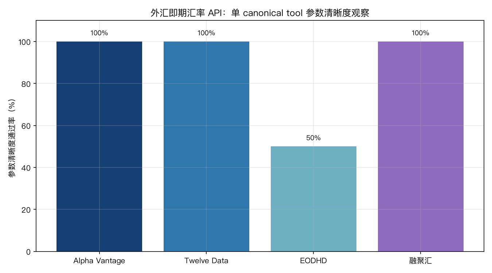
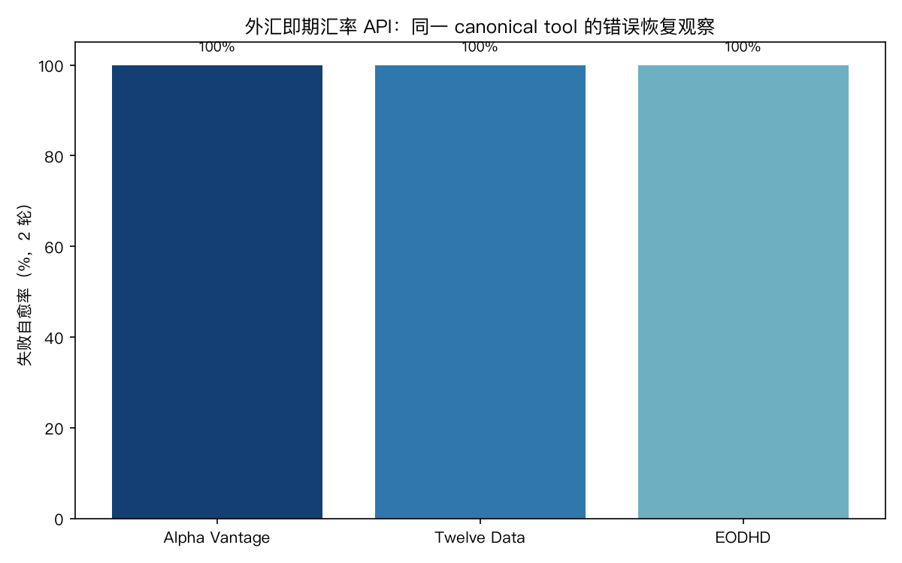

# 2026 外汇汇率 API 对比：6 条接入路径的价格与实测证据

快速结论：

- 本版比较的是 Access Path，不把供应商名称当成测评对象。Alpha Vantage、Twelve Data、EODHD 与融聚汇展示 2026-08-09 已发布的 QVeris Access Path 观测；波兰国家银行 NBP 与同花顺 iFinD 展示 Native Access Path，但当前 FX Direct Test 证据不足。
- 四条已有 QVeris 观测的路径中，Twelve Data 平均延迟最低（0.4 秒）；Alpha Vantage 的响应自解释观察为 6/6；EODHD 的多币种参数是主要卡点；融聚汇只覆盖港币参考汇率且空响应缺少诊断信息。
- 供应商官网价格与 QVeris 路径观测费用是两个独立事实。月费、请求配额与 QVeris credits 不能换算，也不能放在同一价格排序里。

## 6 条外汇数据接入路径对比

| 供应商与接入路径 | 供应商官网价格（2026-08-10 核实） | QVeris 路径观测费用 | Direct Test | 接口观察 | 官方入口 |
|---|---|---:|---|---|---|
| Alpha Vantage · QVeris Access Path | 免费 25 次/日；Premium USD 49.99/月起 | 平均 1.00 credits | 4/4 | 参数 4/4；错误恢复 2/2；响应自解释 6/6 | [官网](https://www.alphavantage.co/) · [价格](https://www.alphavantage.co/premium/) · [在 QVeris 中试用](https://qveris.ai/providers/alphavantage) |
| Twelve Data · QVeris Access Path | Basic 8 API credits/分钟、800/日；Grow USD 29/月起 | 平均 1.19 credits | 4/4 | 参数 4/4；错误恢复 2/2；响应自解释 5/6 | [官网](https://twelvedata.com/) · [价格](https://twelvedata.com/pricing) · [在 QVeris 中试用](https://qveris.ai/providers/twelvedata) |
| EODHD · QVeris Access Path | 免费 20 次/日；All-in-One USD 99.99/月 | 平均 2.81 credits | 4/4 | 参数 2/4；错误恢复 2/2；响应自解释 6/6 | [官网](https://eodhd.com/) · [价格](https://eodhd.com/pricing) · [在 QVeris 中试用](https://qveris.ai/providers/eodhd) |
| 融聚汇 · QVeris Access Path | 商务询价；无公开免费 API 层 | 平均 0.50 credits | 4/4 | 参数 4/4；错误恢复不适用；响应自解释 1/6 | [官网与询价入口](https://www.szfiu.com/custom/detail.php?id=api) · [在 QVeris 中试用](https://qveris.ai/providers/fiu_mcp_server) |
| 波兰国家银行 NBP · Native Access Path | 公共 API 免费，无 API key、无付费方案 | 不适用 | 证据不足 | 本版不展示旧网关结果 | [官方 API](https://api.nbp.pl/en.html) |
| 同花顺 iFinD · Native Access Path | 新账户 2,000 次试用；个人版 CNY 40/月（5,000 次）；企业版 CNY 5,000/月（1,000,000 次） | 不适用 | 证据不足 | 官方 skill v1.3.0 未发布 FX canonical tool | [官网](https://mcp.51ifind.com/) · [价格](https://mcp.51ifind.com/?syncCookieTimes=1#/pricing) |

官网报价描述保留原币种和原计费单位。它回答“向供应商直购的公开套餐是什么”；QVeris credits 只回答“本次 QVeris Access Path 观测记录了多少网关费用”。二者没有声明的换算关系。

## 怎么选

### 全球即期汇率

如果需要 bid/ask 与时间信息，先看 Alpha Vantage；如果优先考虑本次观测延迟，Twelve Data 为 0.4 秒。两者的 Direct Test、参数清晰度与错误恢复观察均完整。

EODHD 适合希望一条数据路径覆盖多资产的场景，但多币种题中模型两轮都没有使用契约提供的批量参数，因此组合请求需要额外约束。这个结论只指向参数清晰度，不是供应商总评分。

### 官方参考汇率

NBP 的 Native API 是免费、无需鉴权的官方汇率来源，适合兑 PLN 的每日参考汇率。当前发布快照没有把该 Native Access Path 的两轮 Direct Test 固化为 release facts，因此只展示官方接入与价格事实，不展示延迟、成功率或 Agent 观察。

### 中国市场与人民币场景

iFinD Native MCP 的官方 skill 包已能证明接入方式和套餐，但 v1.3.0 的公开工具目录没有 FX canonical tool。本版不能把旧 QVeris 工具结果改名成 Native MCP 结果，所以 Direct Test、延迟、参数清晰度与错误恢复均保持证据不足。

### 港币参考汇率

融聚汇的 QVeris Access Path 在 2026-08-09 快照中完成 4/4 Direct Test，适合港股财务折算的港币参考汇率。其响应自解释观察为 1/6，空 `data` 响应也缺少可诊断信息，集成时需要显式补充币对语义和空数据校验。

## 测试方法

### Direct Test

每条纳入的 QVeris Access Path 使用一个固定 canonical tool，执行一个正向用例和一个负向控制，各 2 轮。正向用例检查汇率值与币对标识；负向控制要求返回明确错误或空态，不能编造汇率。

四条已发布观测来自 2026-08-09 快照：

| Access Path | 平均延迟 | QVeris credits | 结果 |
|---|---:|---:|---:|
| Alpha Vantage · QVeris | 0.5s | 1.00 | 4/4 |
| Twelve Data · QVeris | 0.4s | 1.19 | 4/4 |
| EODHD · QVeris | 0.9s | 2.81 | 4/4 |
| 融聚汇 · QVeris | 3.9s | 0.50 | 4/4 |

延迟与 credits 都是 QVeris 网关路径观测，不代表供应商 Native API 的性能或价格。

### Agent 接口观察

Agent Trial 只拿到一个 canonical tool，不做发现、路由或多工具选择。本文分别展示以下观察，不压缩成单一标签：

- 参数清晰度：模型能否在一次调用中填齐必填参数、遵守类型与工具方言。
- 错误恢复：收到真实错误或空态后，能否解释原因并用同一工具修正重试。
- 响应自解释：仅看响应能否确定币对、数值单位与时间/时区。
- 单工具完成：组合问题是否仍由一次 canonical tool 调用完成。

| Access Path | 参数清晰度 | 错误恢复 | 响应自解释 | 主要发现 |
|---|---:|---:|---:|---|
| Alpha Vantage · QVeris | 4/4 | 2/2 | 6/6 | 币种、UTC 时间与 bid/ask 语义完整 |
| Twelve Data · QVeris | 4/4 | 2/2 | 5/6 | epoch 时间戳未显式携带时区 |
| EODHD · QVeris | 2/4 | 2/2 | 6/6 | 多币种题两轮都拆成多次调用 |
| 融聚汇 · QVeris | 4/4 | 不适用 | 1/6 | 基准币种与空响应诊断不足 |
| NBP · Native API | 证据不足 | 证据不足 | 证据不足 | 等待 Native Direct Test release |
| iFinD · Native MCP | 证据不足 | 证据不足 | 证据不足 | 当前官方 skill 未发布 FX canonical tool |

## 供应商官网价格来源

价格仅来自供应商官方页面，并保留核实日期与内容摘要。免费层或套餐页没有写出的内容不会从营销文案推断；只有询价入口的供应商记为“商务询价”。

- [Alpha Vantage Premium](https://www.alphavantage.co/premium/)：免费 25 次/日；Premium USD 49.99/月起。
- [Twelve Data Pricing](https://twelvedata.com/pricing)：Basic 8 API credits/分钟、800/日；Grow USD 29/月起。
- [EODHD Pricing](https://eodhd.com/pricing)：免费 20 次/日；All-in-One USD 99.99/月。
- [NBP Web API](https://api.nbp.pl/en.html)：公共 API 免费且无需 API key。
- [iFinD MCP Pricing](https://mcp.51ifind.com/?syncCookieTimes=1#/pricing)：新账户试用、个人版与企业版按请求额度计费。
- [融聚汇 API 服务](https://www.szfiu.com/custom/detail.php?id=api)：商务询价，无公开价目。

结构化价格事实的 `verified_at`、`source_digest`、`extractor_version`、`suite_fingerprint`、披露状态和来源许可状态保存在 Provider registry；文章不复制官方页面的大段内容。

## 局限与时效

- 2026-08-09 观测是固定用例的两轮冒烟，不是全币对、全市场或 p95 性能认证。
- 四条 QVeris 观测由旧发布稿迁移为按 Access Path 绑定的 release facts；原始响应仍为私有证据，不进入公开仓库。
- NBP 与 iFinD 只展示当前可由官方来源支持的 Native 接入与价格事实。缺少 release evidence 的指标保持不可用，不从供应商声明推断。
- 官网套餐与调用限制可能变化，采购前应再次打开官方价格页核实。
- 本文不计算跨路径复合指标或供应商综合排名。

## 常见问题

**官网月费和 QVeris credits 哪个更便宜？** 不能直接比较。二者属于不同 Access Path、不同计费单位，也没有公开换算关系。

**为什么 NBP 和 iFinD 没有延迟数据？** 本版要求观测必须绑定到精确 Access Path。旧网关结果不能替代 Native API 或 Native MCP 证据，因此暂记为证据不足。

**哪条路径最适合 Agent？** 先按任务筛选，再分别看参数清晰度、错误恢复、响应自解释和单工具完成。本文不把这些维度压成一个标签。

## 更正与复测

我们只发布带来源和路径身份的事实。若你认为某项记录不准确，请提交官方来源或可复现用例；任何供应商都不能购买入选、结论或排序。
