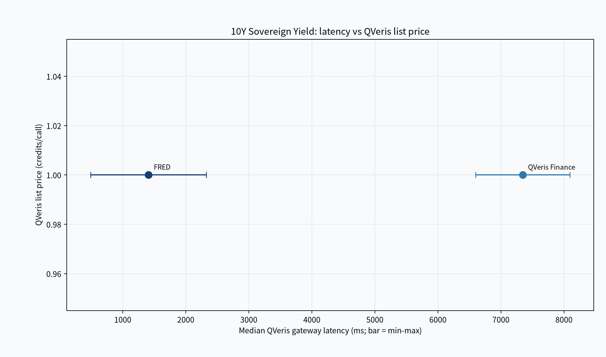
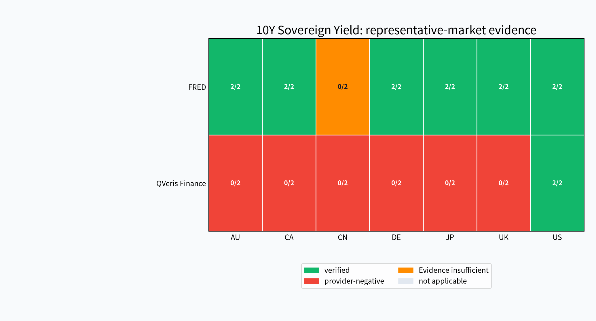

# Best Government Bond Yield APIs for Developers

> Compare two QVeris government bond yield paths using 36 live calls across seven countries, with identity checks, latency, public credits, and evidence limits.

Fixed-window 10-year sovereign benchmark yield retrieval for US, CN, UK, DE, JP, AU, and CA, plus an unsupported-country control through the tested QVeris Access Paths. This edition compares 2 Providers × 2 Access Paths across seven representative markets using 36 release-backed live calls. Every conclusion is scoped to the tested Access Path and observation window, not the Provider's full native API surface.

This comparison is for developers choosing a country-qualified sovereign yield path, not for readers looking for a provider-wide rank. The released evidence is strongest when identity, observation date, runtime behavior, and public list price are read as separate constraints.

## Contents

- [Results at a glance](#results-at-a-glance)
- [How developers should choose](#how-developers-should-choose)
- [Evidence and Provider differences](#evidence-and-provider-differences)
- [What AI Agent builders should verify](#what-ai-agent-builders-should-verify)
- [Method, reproduction, and contribution](#method-reproduction-and-contribution)
- [Limitations, disclosures, and corrections](#limitations-disclosures-and-corrections)
- [FAQ](#faq)

## Results at a glance

| Provider × Access Path | Fixed-sample outcome | Verified representative markets | Median gateway latency | QVeris list credits/call | Official Provider pricing |
|---|---|---|---:|---:|---|
| FRED · QVeris connector · [Official site](https://fred.stlouisfed.org/) · [Try it in QVeris](https://qveris.ai/providers/stlouisfed_fred) | Positive 2/2; invalid control 2/2 | AU, CA, DE, JP, UK, US | 1408 ms (n=2) | 1 | Evidence insufficient |
| QVeris Finance · QVeris connector · [Official site](https://qveris.ai/guides/finance-capabilities/) · [Try it in QVeris](https://qveris.ai/providers/qveris_finance) | Positive 2/2; invalid control 0/2 | US | 7345 ms (n=2) | 1 | Evidence insufficient |

“Verified” means every frozen round met the CAP contract. “Provider-negative” means every round returned an explicit Provider-level negative outcome; it does not prove permanent lack of support. “Not applicable” means the frozen plan excluded that market. “Evidence insufficient” means the Release did not establish either a positive or Provider-negative conclusion.

Read verified as every frozen round meeting the country, tenor, date, value, and identity contract. Provider-negative means the returned result did not satisfy that contract for the tested request; it is not an enduring support claim. Evidence-insufficient preserves cases where the Release establishes neither verified nor Provider-negative behavior.

## How developers should choose

### Broadest released country verification

**Evidence-backed shortlist:** FRED · QVeris connector. Choose the selected path when the priority is the broadest set of country cells that met the frozen identity and yield contract. Keep its inconclusive country cell unknown rather than treating neighboring verified cells as a substitute.

### A country verified through both tested paths

**Evidence-backed shortlist:** QVeris Finance · QVeris connector, FRED · QVeris connector. Either selected path is release-backed for this country cell, so make the next decision using observed latency, source semantics, and invalid-input behavior. This shared result does not extend to another country or tenor.

### Lowest observed gateway latency

**Evidence-backed shortlist:** FRED · QVeris connector. Choose the selected path when the small released gateway sample is the leading runtime constraint. Pair that observation with the target-country cell and treat it as measurement evidence rather than a service-level commitment.

### Lowest public gateway list price

**Evidence-backed shortlist:** QVeris Finance · QVeris connector, FRED · QVeris connector. The selected paths are tied on the frozen public list-price dimension, so price alone does not distinguish them. Continue with country identity, latency, and error behavior, and keep list price separate from account billing or a direct subscription plan.

### Explicit unsupported-country rejection

**Evidence-backed shortlist:** FRED · QVeris connector. Choose the selected path when the tested unsupported-country request must surface as an explicit validation outcome. The other path did not establish that behavior, so application code should still normalize empty, mismatched, and blocked responses separately.

These are conditional recommendations from separate evidence dimensions, never an overall score or winner.

## Evidence and Provider differences

### Why 10Y Sovereign Yield is harder than a basic lookup

A usable sovereign benchmark observation must preserve country and tenor identity together with an in-window date and a finite numeric yield. A plausible yield for the wrong country is unsafe, so the CAP separates verified identity, Provider-negative identity mismatch, explicit invalid-input rejection, and infrastructure blocking.

A sovereign yield payload can look numerically plausible while representing the wrong country, tenor, date, or sampling convention. This CAP therefore requires a finite in-window observation and a frozen benchmark identity, then tests unsupported input separately. The result is a decision fact about a specific Access Path, not a claim about every curve exposed by the underlying source.

### Observed latency and public QVeris list price

[](capability-seo/best-government-bond-yield-apis/charts/latency-list-price-tradeoff.png)

The horizontal axis is median QVeris gateway latency and the bar shows the observed minimum-to-maximum range. The vertical axis is the sanitized QVeris Inspect list price. These are different dimensions: neither axis represents direct Provider subscription price, personal account billing, or a service-level guarantee.

Use the horizontal and vertical dimensions independently: one is observed gateway latency and the other is the frozen public list price. A tie or advantage on one axis does not erase country-identity or error-handling differences, and neither axis is a provider-wide quality score.

### Native plans and QVeris credits are different prices

The comparison table keeps official Provider pricing beside, but separate from, QVeris list credits. Official plan facts carry their own URL and verification date. “Evidence insufficient” is retained when a publishable official price was not frozen for this edition.

### Representative samples across seven markets

[](capability-seo/best-government-bond-yield-apis/charts/market-coverage.png)

| Provider × Access Path | AU | CA | CN | DE | JP | UK | US |
|---|---|---|---|---|---|---|---|
| FRED · QVeris connector | 2/2 verified | 2/2 verified | 0/2 Evidence insufficient | 2/2 verified | 2/2 verified | 2/2 verified | 2/2 verified |
| QVeris Finance · QVeris connector | 0/2 provider-negative | 0/2 provider-negative | 0/2 provider-negative | 0/2 provider-negative | 0/2 provider-negative | 0/2 provider-negative | 2/2 verified |

Each cell is one representative symbol per market from the market Release. A fraction reports passed rounds over frozen rounds; it is not the percentage of all symbols or exchanges supported.

Read each row as one structurally identified Access Path and each column as one country-qualified representative case. The state and fraction come from the frozen rounds; a wrong-country response remains Provider-negative, while an infrastructure-blocked cell remains evidence-insufficient.

### Provider-by-Provider analysis

#### FRED · QVeris connector

A released successful sample recorded benchmark `IRLTLT01AUM156N`, observation date `2024-12-01`, yield value `4.313`, observed source `FRED`, identity verification `true`, identity basis `request_bound`. Verified representative markets: AU, CA, DE, JP, UK, US. Observed median gateway latency: 1408 ms (n=2). QVeris Inspect list price: 1 credits/call.

The released FRED payload did not independently echo benchmark identity; verification was bound to the frozen request series. This path fits developers prioritizing broad released country verification, lower observed gateway latency, and explicit rejection of the tested unsupported identifier. One country cell remained evidence-insufficient after runtime blocking, so the broader matrix still cannot be promoted into universal country support. Consumers must preserve the series-to-country mapping, sampling frequency, and reported date.

#### QVeris Finance · QVeris connector

A released successful sample recorded benchmark `10-Year Treasury Constant Maturity Rate`, observation date `2024-12-31`, yield value `4.58`, reported unit `percent`, observed source `alphavantage`, identity verification `true`, identity basis `response_field`. Verified representative markets: US. Observed median gateway latency: 7345 ms (n=2). QVeris Inspect list price: 1 credits/call.

This path fits a country cell where the released response identity is verified and source routing is acceptable to the application. In the other tested country cells it returned a plausible benchmark tied to a different country identity, so agents must validate the returned benchmark instead of trusting the request parameters alone. Its unsupported-country control also did not establish explicit rejection.

## What AI Agent builders should verify

| Provider × Access Path | Invalid-input handling | Integration note |
|---|---:|---|
| FRED · QVeris connector | 2/2 | Explicit rejection is release-backed. |
| QVeris Finance · QVeris connector | 0/2 | No explicit rejection observed; handle failures defensively. |

The evidence makes identity basis the first application-side guardrail: validate response-field identity when present, and preserve the frozen request-series mapping when a payload does not echo identity. Agents should also preserve observation date and unit, distinguish source routing from the named Access Path, and keep explicit validation, Provider-negative mismatch, rate limiting, entitlement, and infrastructure blocking as separate states. Pagination, schema stability, language mapping, and single-tool behavior remain unmeasured.

This is not an AI-friendly score. The current Release does not establish pagination behavior, schema stability across versions, language mapping, single-tool completion. Validate returned country identity, tenor semantics, observation date, yield unit, source routing, invalid-input behavior in the application boundary.

## Method, reproduction, and contribution

### How we tested

The baseline suite froze one US 10-year benchmark request and one unsupported-country control for each included Access Path. The market suite ran one country-qualified 10-year benchmark case in two rounds across all seven frozen countries. Public terminal evidence is sanitized and digest-bound; private raw responses remain outside the repository.

The baseline Release digest is `sha256:960e8586be949d52a1663cdafc8562c8dd420cf13d87d9b00a90021656c372af`. The market Release digest is `sha256:1016ff6979c087626a2bbbcfd78b986e21f316d8420aa79966fcc9d6e267c83a`.

### No key required: reproduce the publication offline

```bash
uv run qveris-bench publication reproduce --package docs/guides/capability-seo/best-government-bond-yield-apis/manifest.yaml --expected-package-digest <published-digest>
```

Replace `<published-digest>` with the digest distributed by the trusted GitHub Release or CI attestation outside the checkout. The command rebuilds the Selection Snapshot, writer input, article facts, charts, and guide from committed public evidence without calling QVeris or any Provider; a digest stored only in the same mutable checkout is not a trust anchor.

### With a configured key: start a new live evidence run

```bash
gh workflow run live-govt-bond-yield-baseline-e2e.yml && gh workflow run live-govt-bond-yield-market-e2e.yml
```

The workflows read `QVERIS_API_KEY` from the protected `benchmark-e2e` GitHub environment and emit a new artifact set. Release assembly must use a new Release ID; it never overwrites the evidence cited by this edition.

### How Providers and developers can participate

Contributions may add a frozen binding, representative case, publishable pricing fact, sanitized evidence, or factual correction through the repository. Inclusion and conclusions cannot be purchased, and every new claim must remain reproducible from a new immutable Release.

## Limitations, disclosures, and corrections

This edition measures a fixed historical window, one sovereign benchmark tenor, and a small number of gateway observations through the named Access Paths. It does not establish every curve, instrument, sampling frequency, native interface, future routing decision, or service level. Public list price and observed runtime are separate from direct subscription terms and account billing.

- One frozen 10-year benchmark per country does not prove every sovereign curve, tenor, date, or instrument.
- Monthly and daily source series can have different latest in-window dates and must not be treated as the same sampling frequency.
- A Provider-negative identity mismatch is scoped to the tested Access Path and request; it is not proof of permanent country non-support.
- Latency samples describe the tested QVeris Access Path and observation window, not an SLA.
- QVeris list credits are sanitized Inspect prices and are separate from account billing or official Provider subscription pricing.
- Corrections require a new evidence-bound publication package; historical Releases remain immutable.

## FAQ

### Is there a single winner?

No. Choose by the country cell, identity behavior, observed runtime, public list price, and invalid-input contract that matter to the application. Those dimensions can point to different paths.

### Why can a numerically valid yield still fail the CAP?

Because a plausible value for the wrong sovereign benchmark is unsafe. The frozen contract requires returned identity, date, and value to agree with the requested country-qualified case.

### Can the publication be reproduced without Provider credentials?

Yes. Offline reproduction rebuilds the publication from immutable released facts and sanitized public evidence. It verifies the cited package without making fresh Provider calls.

### How is a fresh live edition created?

Run the frozen workflows with an authorized credential and publish the results under new immutable Release identities. A rerun must not overwrite the evidence boundary used by this edition.

### Does a verified country cell prove every sovereign curve is supported?

No. Verification applies only to the frozen representative request and rounds. It does not extend to other tenors, instruments, dates, sampling conventions, or native interfaces.
