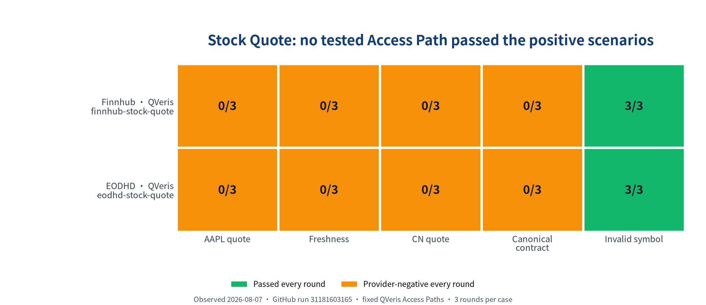

# Stock Quote API Test 2026: Finnhub vs EODHD

Neither tested Access Path qualified in this edition. Across 30 live calls, the fixed Finnhub and EODHD QVeris Access Paths both handled the invalid-symbol control in 3/3 rounds, but neither returned a quote that met the frozen contract in any of the four positive scenarios. This is a useful result for developers: it tells you not to treat a successful tool call as proof that a quote is current, correctly identified, and usable.

## Quick answer

| Provider | Tested Access Path | AAPL quote | Freshness | CN quote | Canonical contract | Invalid symbol | Decision |
|---|---|---:|---:|---:|---:|---:|---|
| Finnhub | `finnhub-stock-quote` via QVeris | 0/3 | 0/3 | 0/3 | 0/3 | 3/3 | Not qualified |
| EODHD | `eodhd-stock-quote` via QVeris | 0/3 | 0/3 | 0/3 | 0/3 | 3/3 | Not qualified |

`0/3` means the same frozen scenario was executed three times and none of the three terminal outcomes satisfied its completion conditions. It does not mean that the provider never supports the feature. It means this exact Provider × Access Path combination did not pass this test edition.

If you need a stock quote API today, do not select either tested path from this result alone. Reproduce the package, inspect the failure boundary, and run a successor Release after the Access Path or extractor changes. Provider marketing pages are useful for discovery, but they do not override the observed outcome.

## What developers should care about in a stock quote API

A price without a trustworthy identity and timestamp is not a quote contract. For a production application or AI Agent, evaluate these dimensions in order:

1. **Security identity:** the response must map back to the requested canonical symbol. A non-empty symbol is insufficient if it identifies a different security.
2. **Timestamp validity and freshness:** the timestamp must be parseable, timezone-aware, and inside the product's disclosed freshness window.
3. **Price semantics:** the number must be finite and positive, with a clear understanding of whether it is last trade, delayed quote, midpoint, or another value.
4. **Negative-input behavior:** an invalid symbol should produce an explicit terminal error, not zero-filled or fabricated quote fields.
5. **Market coverage:** support should be measured with representative symbols per market. A provider-wide country list is not evidence that this Access Path returns this CAP.
6. **Price and latency:** compare them only after the response satisfies the quote contract. A fast invalid or stale response is not a better quote.

## Test results

[](capability-seo/stock-quote-api-test/charts/stock-quote-outcomes.png)

Green means every round passed. Orange means every round reached a provider-negative terminal outcome. The matrix is deliberately not a score: each column represents a separate contract that a developer may care about.

### Why Finnhub did not qualify

The tested Finnhub QVeris Access Path returned a stale timestamp in the AAPL quote and freshness scenarios. The CN scenarios for `600519.SH` ended as unavailable quotes. Invalid-symbol handling passed 3/3, which is a useful control result, but it cannot compensate for failed positive quote retrieval.

### Why EODHD did not qualify

The tested EODHD QVeris Access Path returned an invalid timestamp in the AAPL quote and freshness scenarios. The CN scenarios for `600519.SH` ended as unavailable quotes. Invalid-symbol handling passed 3/3, but the positive quote contract remained unmet.

## Pricing context

| Provider | Official pricing observed in the registry | QVeris credits per call |
|---|---|---|
| Finnhub | Free plan with 60 API calls per minute; All-in-One USD 3,500/month billed annually | Not measured for this publication |
| EODHD | 20 API calls per day; All-in-One USD 99.99/month | Not measured for this publication |

See [Finnhub pricing](https://finnhub.io/pricing) and [EODHD pricing](https://eodhd.com/pricing) for current plan details. These are declared official-price facts, not measurements of account billing. The publication leaves QVeris credits unavailable because it does not contain a same-edition, digest-bound `qveris inspect` price snapshot.

## How we tested

The frozen suite used two QVeris Access Paths, five cases, and three Direct Test rounds per case: `2 × 5 × 3 = 30` live calls. The positive cases covered an AAPL quote, AAPL timestamp freshness, a representative CN quote for `600519.SH`, and a canonical single-tool contract for the same CN security. The negative control used `NOTASTOCK`.

The minimum positive contract required `symbol`, a finite positive `price`, and an ISO 8601 timestamp no more than 900 seconds old. The negative control required a non-empty validation error and prohibited invented quote fields. Outcomes were kept separate for each Provider × Access Path; no provider total or cross-task score was calculated.

The observations came from successful GitHub Actions run `31181603165` on 2026-08-07. The immutable Release stores 30 terminal cells and 30 public evidence records. Public terminals are sanitized; raw responses remain private by default.

## How to reproduce the publication

Clone the [QVeris Capability Benchmarks repository](https://github.com/QVerisAI/qveris-capability-benchmarks), install the project, and run:

```bash
uv run qveris-bench publication reproduce \
  --package docs/guides/capability-seo/stock-quote-api-test/manifest.yaml
```

This command requires no provider key and no QVeris API key. It replays the immutable Release, verifies all public terminal digests, rebuilds the Selection Snapshot and chart in a temporary directory, and checks the material article claims and links. A mismatch fails closed.

To rerun the live provider calls rather than reproduce the published package, use the repository's Stock Quote workflow with your authorized QVeris credentials. A live rerun creates new evidence; it does not rewrite this Release.

## How to contribute

Use the repository's issue and pull-request flow to propose another Provider × Access Path, a better representative case, or a correction. A provider submission must keep its own Access Path identity, run the same applicable Direct Test cells, and carry evidence provenance. Provider claims can suggest what to test, but cannot become measured facts without a released observation.

## Limitations, disclosure, and corrections

- This edition compares only two QVeris Access Paths. It does not evaluate Finnhub or EODHD native APIs.
- `US` and `CN` are representative tested inputs, not proof of provider-wide market coverage.
- The Release observed stale or invalid timestamps and unavailable CN quotes at one point in time. Provider behavior may change, which is why a successor Release is preferable to silently editing this result.
- Official pricing can change after the registry verification date. Confirm commercial terms with the provider before purchasing.
- No Agent Trial was run. The canonical-contract case is a Direct Test through one fixed tool, not an Agent-friendly rating.

Corrections should preserve the old Release and add a successor Release or an explicit editorial correction with evidence. That makes changes auditable instead of rewriting history.

## FAQ

### Does 0/3 mean Finnhub or EODHD does not support stock quotes?

No. It means the tested QVeris Access Path did not satisfy the frozen scenario in any of three rounds. It is not a provider-wide capability claim.

### Why did invalid-symbol handling pass while the provider did not qualify?

Negative-input behavior is one independent contract. A path must also return a valid, current, correctly identified quote for positive inputs.

### Why is there no latency ranking?

The positive responses did not meet the quote contract. Ranking their latency would reward fast failures and would not help a developer choose a usable quote source.

### Why is there no overall score?

An overall score would hide which contract failed and would encourage false precision. This benchmark publishes scenario-level outcomes so developers can apply their own requirements.

### Can an AI Agent use these results directly?

It can use them as a guardrail: neither tested path should be selected as a verified quote source from this edition. Before production use, the Agent still needs a successor passing Release, explicit symbol mapping, timestamp validation, and deterministic negative-input handling.

For the surrounding workflow, see [Capability Discovery for AI Agents](https://qveris.ai/guides/capability-discovery-ai-agents/) and the [QVeris CLI guide](https://qveris.ai/guides/qveris-cli/).
